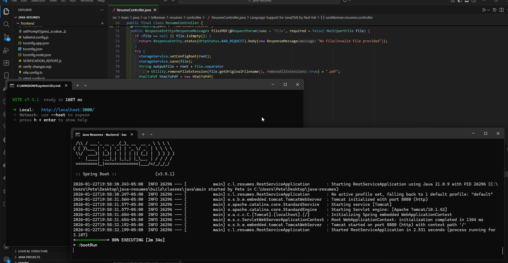
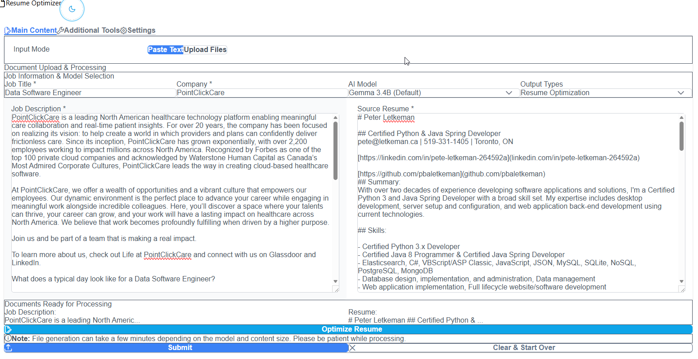
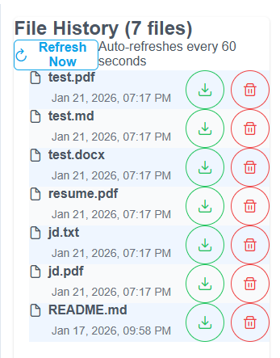
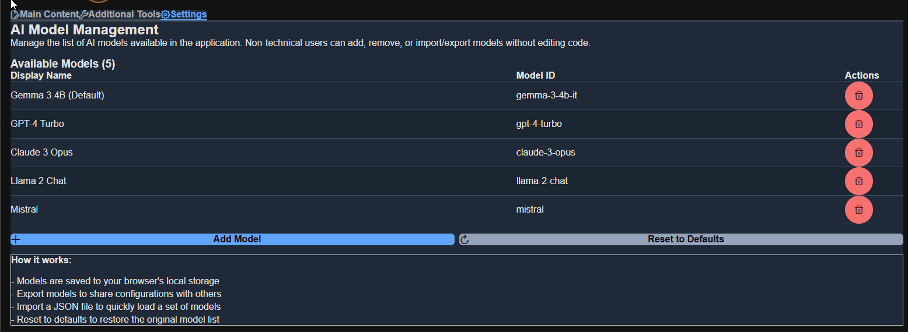
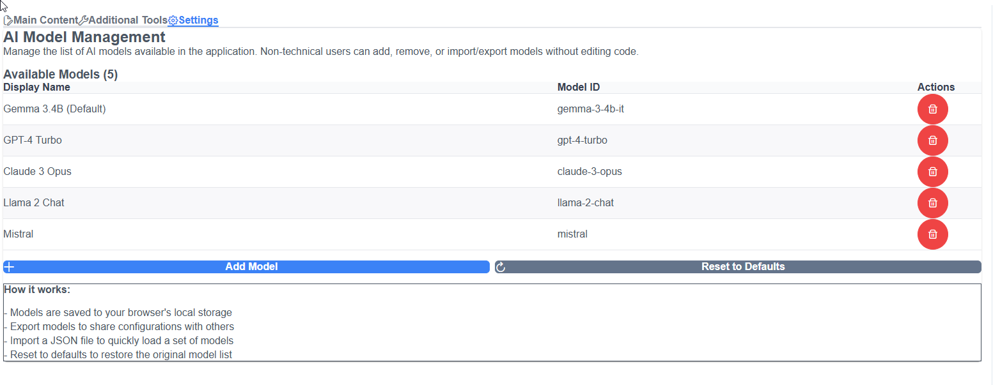
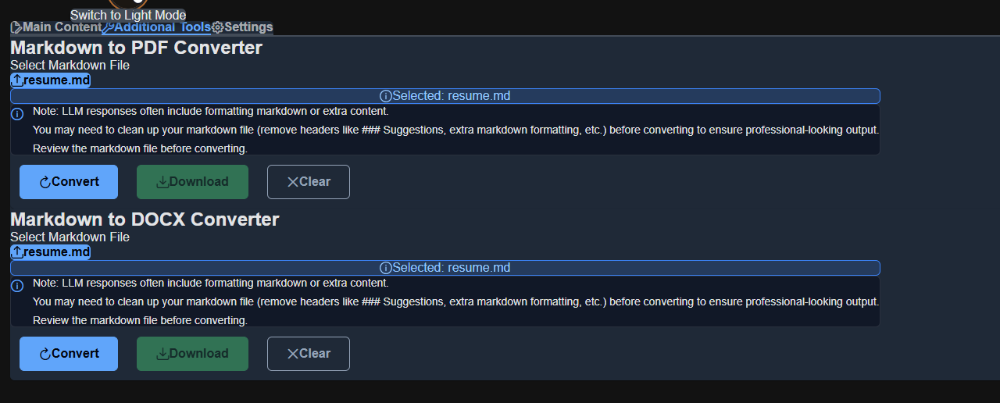
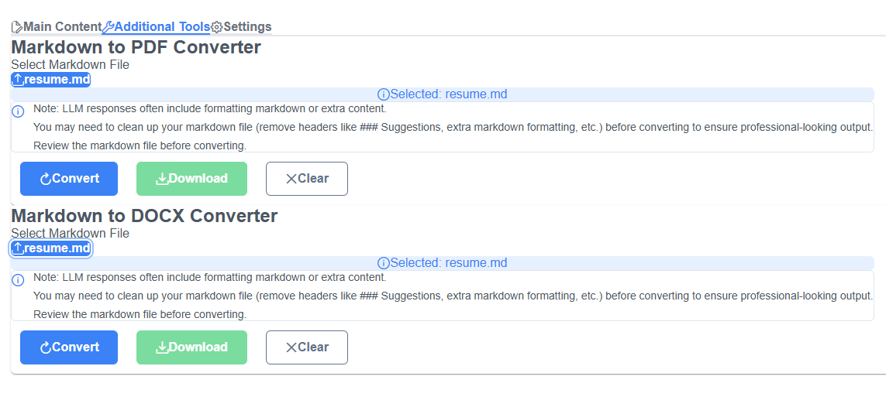
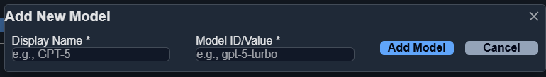
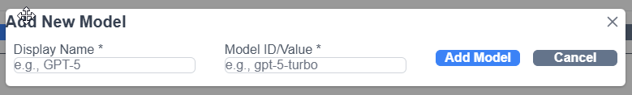

# Development Setup - Docker Compose with Vite Dev Server

Comprehensive guide for running java-resumes services locally with hot reload and visible logs.

- [Development Setup - Docker Compose with Vite Dev Server](#development-setup---docker-compose-with-vite-dev-server)
  - [⚡ Quick Start](#-quick-start)
  - [What You'll See](#what-youll-see)
  - [🎨 UI Preview](#-ui-preview)
    - [Main Tab (Resume Editor)](#main-tab-resume-editor)
    - [File History Tab](#file-history-tab)
    - [Settings Tab](#settings-tab)
    - [Tools Tab](#tools-tab)
    - [Add Model Dialog](#add-model-dialog)
  - [What You'll See](#what-youll-see-1)
  - [Access Services](#access-services)
  - [Features](#features)
  - [File Structure](#file-structure)
  - [Commands](#commands)
    - [Run with Logs Visible](#run-with-logs-visible)
    - [Run in Background](#run-in-background)
    - [View Logs](#view-logs)
    - [Stop Services](#stop-services)
    - [Rebuild Images](#rebuild-images)
  - [Common Issues](#common-issues)
    - [Can't see Vite startup message](#cant-see-vite-startup-message)
    - [Hot reload not working](#hot-reload-not-working)
    - [Port already in use](#port-already-in-use)
    - [Backend not accessible from frontend](#backend-not-accessible-from-frontend)
  - [Development Workflow](#development-workflow)
  - [Switching Between Dev and Production](#switching-between-dev-and-production)
    - [Use Development Setup (Vite Dev Server)](#use-development-setup-vite-dev-server)
    - [Switch to Production Setup (Static Nginx)](#switch-to-production-setup-static-nginx)
  - [Environment Variables](#environment-variables)
    - [Frontend (Development)](#frontend-development)
    - [Backend](#backend)
  - [Troubleshooting](#troubleshooting)
    - [Services won't start](#services-wont-start)
    - [Clear everything and restart](#clear-everything-and-restart)
    - [Need to run commands in container](#need-to-run-commands-in-container)
  - [Next Steps](#next-steps)
  - [Related Files](#related-files)

---

## ⚡ Quick Start

```bash
# (Optional) Configure environment variables
cp .env.example .env
# Edit .env if you want to change database credentials or other settings

# Build images
docker-compose build

# Start services (shows all logs in terminal)
docker-compose up

# Press Ctrl+C to stop
```

**Note:** For PostgreSQL configurations (`docker-compose.postgresql.yml`, `docker-compose.ollama-postgresql.yml`), database credentials can be customized via environment variables in `.env`. See [Environment Variables](#environment-variables) section for details.

## What You'll See

```
resume-backend    |
resume-backend    |   .   ____          _            __ _ _
resume-backend    |  /\\ / ___'_ __ _ _(_)_ __  __ _ \ \ \ \
resume-backend    | ( ( )\___ | '_ | '_| | '_ \/ _` | \ \ \ \
resume-backend    |  \\/  ___)| |_)| | | | | || (_| |  ) ) ) )
resume-backend    |   '  |____| .__|_| |_|_| |_\__, | / / / /
resume-backend    |  =========|_|==============|___/=/_/_/_/
resume-backend    | :: Spring Boot ::                (v3.5.1)
resume-backend    | ...
resume-backend    | Tomcat started on port(s): 8080 (http) with context path ''
resume-backend    |
resume-frontend   |
resume-frontend   |   VITE v7.3.1  ready in 205 ms
resume-frontend   |
resume-frontend   |   ➜  Local:   http://localhost:3000
resume-frontend   |   ➜  Network: http://172.19.0.3:3000
resume-frontend   |   ➜  press h + enter to show help
```

**See the complete startup in this screenshot:**



---

## 🎨 UI Preview

The frontend is available in both **dark** and **light** themes:

### Main Tab (Resume Editor)

|                               Dark Theme                                |                                Light Theme                                |
| :---------------------------------------------------------------------: | :-----------------------------------------------------------------------: |
|  |  |

### File History Tab

|                                   Dark Theme                                    |                                    Light Theme                                    |
| :-----------------------------------------------------------------------------: | :-------------------------------------------------------------------------------: |
|  |  |

### Settings Tab

|                                   Dark Theme                                    |                                    Light Theme                                    |
| :-----------------------------------------------------------------------------: | :-------------------------------------------------------------------------------: |
|  |  |

### Tools Tab

|                                Dark Theme                                 |                                 Light Theme                                 |
| :-----------------------------------------------------------------------: | :-------------------------------------------------------------------------: |
|  |  |

### Add Model Dialog

|                                Dark Theme                                 |                                 Light Theme                                 |
| :-----------------------------------------------------------------------: | :-------------------------------------------------------------------------: |
|  |  |

---

## What You'll See

```
resume-backend    |
resume-backend    |   .   ____          _            __ _ _
resume-backend    |  /\\ / ___'_ __ _ _(_)_ __  __ _ \ \ \ \
resume-backend    | ( ( )\___ | '_ | '_| | '_ \/ _` | \ \ \ \
resume-backend    |  \\/  ___)| |_)| | | | | || (_| |  ) ) ) )
resume-backend    |   '  |____| .__|_| |_|_| |_\__, | / / / /
resume-backend    |  =========|_|==============|___/=/_/_/_/
resume-backend    | :: Spring Boot ::                (v3.5.1)
resume-backend    | ...
resume-backend    | Tomcat started on port(s): 8080 (http) with context path ''
resume-backend    |
resume-frontend   |
resume-frontend   |   VITE v7.3.1  ready in 205 ms
resume-frontend   |
resume-frontend   |   ➜  Local:   http://localhost:3000
resume-frontend   |   ➜  Network: http://172.19.0.3:3000
resume-frontend   |   ➜  press h + enter to show help
```

## Access Services

| Service        | URL                                         | Purpose                   |
| -------------- | ------------------------------------------- | ------------------------- |
| Frontend       | http://localhost:3000                       | React app with hot reload |
| Backend        | http://localhost:8080                       | Spring Boot API           |
| API Docs       | http://localhost:8080/swagger-ui/index.html | API documentation         |
| Backend Health | http://localhost:8080/api/health            | Health check endpoint     |

## Features

✅ **Hot Module Reload (HMR)** - Frontend changes reload instantly
✅ **Visible Logs** - See all startup messages and debug logs
✅ **TTY Enabled** - Interactive terminal with color output
✅ **Development Mode** - All dev dependencies included
✅ **Synchronized Networking** - Services communicate via container network

## File Structure

```
frontend/
├── Dockerfile        # Production build (static Nginx)
├── Dockerfile.dev    # Development build (Vite dev server)
├── vite.config.ts    # Configured for port 3000
└── package.json      # npm scripts

docker-compose.yml    # Uses Dockerfile.dev for development
```

## Commands

### Run with Logs Visible

```bash
docker-compose up
```

### Run in Background

```bash
docker-compose up -d
```

### View Logs

```bash
docker-compose logs -f          # Follow all logs
docker-compose logs -f frontend # Follow frontend only
docker-compose logs -f backend  # Follow backend only
```

### Stop Services

```bash
docker-compose down              # Stop and remove containers
docker-compose down -v           # Also remove volumes
```

### Rebuild Images

```bash
docker-compose build --no-cache
```

## Common Issues

### Can't see Vite startup message

- Ensure `stdin_open: true` and `tty: true` are set in docker-compose.yml
- Run with `docker-compose up` (not in detached mode `-d`)

### Hot reload not working

- Verify `Dockerfile.dev` is being used (not production `Dockerfile`)
- Check that file watching is enabled in vite.config.ts

### Port already in use

```bash
# Find and kill process using port 3000
lsof -i :3000
kill -9 <PID>

# Or use different port
docker-compose down
# Edit docker-compose.yml ports: "3001:3000"
docker-compose up
```

### Backend not accessible from frontend

- Verify both containers are on the same network: `resume-app-network`
- Use `http://backend:8080` (internal DNS) instead of localhost

## Development Workflow

1. **Start Services**

   ```bash
   docker-compose up
   ```

2. **Watch Logs** - Keep terminal open to see messages

3. **Edit Frontend** - Make changes in `frontend/src/`
   - Changes automatically reload in browser
   - Check console for any errors

4. **Edit Backend** - Make changes in `src/main/java/`
   - Requires rebuild: `docker-compose build` and `docker-compose up`
   - Or restart: `docker-compose restart backend`

5. **View Results** - Open http://localhost:3000 in browser

## Switching Between Dev and Production

### Use Development Setup (Vite Dev Server)

```bash
# Already configured in docker-compose.yml
docker-compose build
docker-compose up
# Access at http://localhost:3000
```

### Switch to Production Setup (Static Nginx)

1. Edit `docker-compose.yml`:

   ```yaml
   frontend:
     build:
       dockerfile: Dockerfile # Change from Dockerfile.dev
     ports:
       - "80:80" # Change from "3000:3000"
   ```

2. Rebuild and run:
   ```bash
   docker-compose build
   docker-compose up
   # Access at http://localhost:80
   ```

## Environment Variables

All services can be configured using environment variables. For local development, copy `.env.example` to `.env` and customize as needed:

```bash
cp .env.example .env
# Edit .env with your preferred editor
```

### PostgreSQL Database (for PostgreSQL configurations)

**Important:** These credentials are for local development only. **Always change them for production deployments!**

```
POSTGRES_DB=resume_db
POSTGRES_USER=resume_user
POSTGRES_PASSWORD=resume_password
```

The docker-compose files will use these environment variables if set, or fall back to the defaults shown above. Docker Compose automatically substitutes these values into the Spring datasource configuration, so you only need to set the `POSTGRES_*` variables.

### Frontend (Development)

```
VITE_API_BASE_URL=http://backend:8080
NODE_ENV=development
VITE_HOST=0.0.0.0
```

### Backend

```
SPRING_PROFILES_ACTIVE=prod
UPLOAD_PATH=files
LLM_ENDPOINT=http://host.docker.internal:11434/v1/chat/completions
LLM_APIKEY=not-needed-for-local
```

## Troubleshooting

### Services won't start

```bash
# Check for port conflicts
docker ps
docker-compose up --build

# Check logs for errors
docker-compose logs
```

### Clear everything and restart

```bash
docker-compose down -v
docker system prune -a
docker-compose build --no-cache
docker-compose up
```

### Need to run commands in container

```bash
# Execute in running container
docker-compose exec frontend npm list
docker-compose exec backend ./gradlew --version

# Run shell in container
docker-compose exec frontend sh
docker-compose exec backend bash
```

## Next Steps

- Edit frontend at `frontend/src/` - changes reload instantly
- Edit backend at `src/main/java/` - rebuild with `docker-compose build && docker-compose up`
- Run `docker-compose logs` to monitor all activity
- Access http://localhost:3000 to see your app

## Related Files

- [docker-compose.yml](docker-compose.yml) - Main configuration
- [frontend/Dockerfile.dev](frontend/Dockerfile.dev) - Dev Dockerfile
- [frontend/vite.config.ts](frontend/vite.config.ts) - Vite configuration
- [Dockerfile](Dockerfile) - Backend container configuration

---

**Last Updated:** February 2, 2026
**Maintained By:** java-resumes development team
