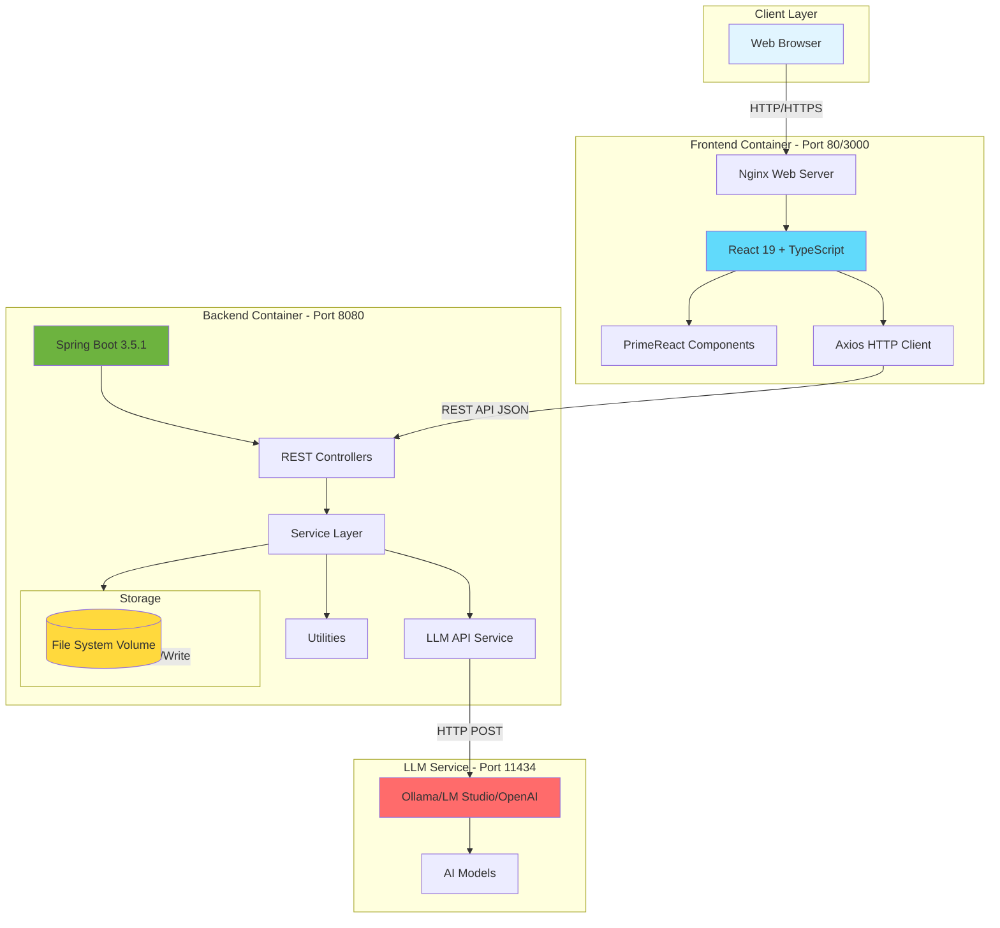
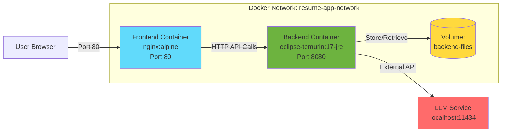

# Java Resumes - Full-Stack Resume Optimization Application

[](https://openjdk.java.net/)
[](https://spring.io/projects/spring-boot)
[](https://reactjs.org/)
[](https://www.typescriptlang.org/)
[](https://www.docker.com/)
[](LICENSE)

AI-powered full-stack application for resume and cover letter optimization using Large Language Models. Built with Spring Boot, React, PrimeReact, and Docker for seamless deployment.

---

## 📋 Table of Contents

- [Overview](#-overview)
- [Problem Statement](#-problem-statement)
- [Solution](#-solution)
- [Architecture](#-architecture)
- [Technology Stack](#%EF%B8%8F-technology-stack)
- [Quick Start with Docker](#-quick-start-with-docker)
- [Directory Structure](#-directory-structure)
- [Development Setup](#-development-setup)
- [Production Deployment](#-production-deployment)
- [API Endpoints](#-api-endpoints)
- [Features](#-features)
- [Screenshots](#%EF%B8%8F-screenshots)
- [Testing](#-testing)
- [Code Quality](#-code-quality)
- [Environment Variables](#-environment-variables)
- [Troubleshooting](#-troubleshooting)
- [Contributing](#-contributing)
- [License](#-license)
- [Documentation](#-documentation)

---

## 🌟 Overview

**Java Resumes** is a modern, production-ready full-stack application that helps job seekers create optimized, tailored resumes and cover letters using AI technology. The application features a responsive React frontend with PrimeReact components, a robust Java Spring Boot backend, and complete Docker containerization for consistent deployment.

### Key Capabilities

- 📄 **Resume Optimization**: AI-powered resume tailoring to match job descriptions
- ✉️ **Cover Letter Generation**: Automated, personalized cover letter creation
- 📊 **ATS Optimization**: Ensure resumes pass Applicant Tracking Systems
- 🔍 **Skills Gap Analysis**: Identify missing skills and certifications
- 📝 **Markdown to PDF**: Convert markdown documents to professional PDFs
- 💾 **File Management**: Upload, download, and manage documents
- 🎨 **Theme Support**: Light and dark themes with persistent preferences
- 🚀 **Containerized**: Docker Compose for one-command deployment

---

## ❓ Problem Statement

Every job posting requires a uniquely tailored resume and cover letter, which can take an hour or more to create manually:

- **Miss Details**: May overlook important requirements in job descriptions
- **Include Irrelevant Content**: Accidentally include experience that turns off employers
- **Omit Skills**: Forget to include vital skills employers are seeking
- **No Insight**: Lack guidance on certifications or skills to acquire
- **Time-Consuming**: Manual tailoring takes 1-2 hours per application
- **Inconsistent Format**: Difficult to maintain professional formatting

---

## ✅ Solution

Java Resumes leverages Large Language Models (LLMs) to streamline the entire process:

1. **Accept Input**: Job description and current resume (text or file upload)
2. **Process with AI**: Sends content to LLM for intelligent analysis
3. **Generate Output**: Creates optimized resume and/or cover letter
4. **Export Formats**: Provides both Markdown and PDF versions
5. **Identify Gaps**: Suggests certifications and skills to acquire
6. **Manage Files**: Store, download, and organize all documents

### Workflow

```
User Input (Job Description + Resume)
         ↓
  Frontend (React + PrimeReact)
         ↓
   REST API (Spring Boot)
         ↓
  LLM Service (Ollama/OpenAI)
         ↓
  AI Processing & Optimization
         ↓
Generated Documents (MD + PDF)
         ↓
   File Storage & Download
```

---

## 🏗️ Architecture

### High-Level Architecture (ASCII)

```
┌─────────────────────────────────────────────────────────────────────┐
│                         USER BROWSER                                │
│                    (Chrome, Firefox, Safari)                        │
└────────────────────────────────┬────────────────────────────────────┘
                                 │ HTTP/HTTPS
                                 ↓
┌─────────────────────────────────────────────────────────────────────┐
│                      FRONTEND (Port 80/3000)                        │
│  ┌───────────────────────────────────────────────────────────┐     │
│  │  React 19 + TypeScript + PrimeReact + Tailwind CSS       │     │
│  │  - Main Content Tab (Upload & Process)                   │     │
│  │  - Additional Tools Tab (Markdown to PDF)                │     │
│  │  - File History Panel (List, Download, Delete)           │     │
│  │  - Theme Toggle (Light/Dark)                             │     │
│  └───────────────────────────────────────────────────────────┘     │
│                      Nginx (Reverse Proxy)                          │
└────────────────────────────────┬────────────────────────────────────┘
                                 │ REST API (JSON)
                                 ↓
┌─────────────────────────────────────────────────────────────────────┐
│                       BACKEND (Port 8080)                           │
│  ┌───────────────────────────────────────────────────────────┐     │
│  │  Spring Boot 3.5.1 + Java 17 + Gradle                    │     │
│  │  ┌─────────────────────────────────────────────────┐     │     │
│  │  │  Controller Layer (REST Endpoints)              │     │     │
│  │  │  - ResumeController                             │     │     │
│  │  │  - /upload, /files/*, /markdownFile2PDF        │     │     │
│  │  └─────────────────────────────────────────────────┘     │     │
│  │  ┌─────────────────────────────────────────────────┐     │     │
│  │  │  Service Layer (Business Logic)                 │     │     │
│  │  │  - FilesStorageService                          │     │     │
│  │  │  - ApiService (LLM Integration)                 │     │     │
│  │  └─────────────────────────────────────────────────┘     │     │
│  │  ┌─────────────────────────────────────────────────┐     │     │
│  │  │  Utilities                                      │     │     │
│  │  │  - HtmlToPdf (Document Conversion)              │     │     │
│  │  │  - File Management (Upload/Download/Delete)     │     │     │
│  │  └─────────────────────────────────────────────────┘     │     │
│  └───────────────────────────────────────────────────────────┘     │
└────────────────────────────────┬────────────────────────────────────┘
                                 │ HTTP REST API
                                 ↓
┌─────────────────────────────────────────────────────────────────────┐
│                    LLM SERVICE (Port 11434/1234)                    │
│  ┌───────────────────────────────────────────────────────────┐     │
│  │  Ollama / LM Studio / OpenAI                              │     │
│  │  - Model: gemma-3-4b-it / llama3 / gpt-4                 │     │
│  │  - Resume Optimization                                    │     │
│  │  - Cover Letter Generation                                │     │
│  │  - Skills Gap Analysis                                    │     │
│  └───────────────────────────────────────────────────────────┘     │
└─────────────────────────────────────────────────────────────────────┘
                                 ↓
┌─────────────────────────────────────────────────────────────────────┐
│                      FILE STORAGE (Volume)                          │
│  - Uploaded Documents (resumes, job descriptions)                   │
│  - Generated Documents (optimized resumes, cover letters)           │
│  - Converted PDFs                                                   │
└─────────────────────────────────────────────────────────────────────┘
```

### System Architecture (Mermaid)



### Container Network Diagram



---

## 🛠️ Technology Stack

### Frontend Technologies

| Component            | Technology         | Version | Purpose                           |
| -------------------- | ------------------ | ------- | --------------------------------- |
| **Framework**        | React              | 19.2.0  | UI component library              |
| **Language**         | TypeScript         | 5.9.3   | Type-safe JavaScript              |
| **Build Tool**       | Vite               | 7.2.4   | Fast build and dev server         |
| **UI Library**       | PrimeReact         | 10.9.7  | Professional UI components        |
| **Icons**            | PrimeIcons         | 7.0.0   | Icon library                      |
| **Styling**          | Tailwind CSS       | 4.1.18  | Utility-first CSS                 |
| **HTTP Client**      | Axios              | 1.13.2  | API communication                 |
| **Testing**          | Vitest             | 4.0.17  | Unit testing framework            |
| **Testing Library**  | React Testing Lib  | 16.3.1  | Component testing                 |
| **Package Manager**  | npm                | 10+     | Dependency management             |
| **Web Server**       | Nginx              | alpine  | Production web server             |

### Backend Technologies

| Component            | Technology         | Version | Purpose                           |
| -------------------- | ------------------ | ------- | --------------------------------- |
| **Language**         | Java               | 17 LTS  | Backend programming language      |
| **Framework**        | Spring Boot        | 3.5.1   | Application framework             |
| **Build Tool**       | Gradle             | 8.7     | Build automation                  |
| **API Docs**         | SpringDoc OpenAPI  | 2.8.7   | Swagger/OpenAPI documentation     |
| **PDF Generation**   | Flying Saucer      | 9.1.22  | HTML to PDF conversion            |
| **Markdown Parser**  | CommonMark         | 0.24.0  | Markdown processing               |
| **HTML Parser**      | Jsoup              | 1.15.4  | HTML parsing                      |
| **JSON**             | Gson               | 2.13.1  | JSON serialization                |
| **Testing**          | JUnit 5            | 5.x     | Unit testing framework            |
| **Code Quality**     | Checkstyle         | 10.14.2 | Code style enforcement            |

### DevOps & Infrastructure

| Component            | Technology         | Version | Purpose                           |
| -------------------- | ------------------ | ------- | --------------------------------- |
| **Containerization** | Docker             | 20.10+  | Application containerization      |
| **Orchestration**    | Docker Compose     | 2.0+    | Multi-container management        |
| **Frontend Image**   | node:20-alpine     | latest  | Build stage                       |
| **Frontend Runtime** | nginx:alpine       | latest  | Production runtime                |
| **Backend Build**    | gradle:8.7-jdk17   | 8.7     | Build stage                       |
| **Backend Runtime**  | eclipse-temurin:17 | 17-jre  | Production runtime                |

### AI/LLM Integration

| Service          | Purpose                  | Default Port |
| ---------------- | ------------------------ | ------------ |
| **Ollama**       | Local LLM inference      | 11434        |
| **LM Studio**    | Local LLM inference      | 1234         |
| **OpenAI API**   | Cloud LLM service        | 443 (HTTPS)  |

---

## 🚀 Quick Start with Docker

The fastest way to get started is using Docker Compose, which sets up the entire stack with one command.

### Prerequisites

- **Docker** 20.10+ installed ([Get Docker](https://docs.docker.com/get-docker/))
- **Docker Compose** 2.0+ installed (included with Docker Desktop)
- **LLM Service** running (Ollama, LM Studio, or OpenAI API key)

### Step 1: Clone the Repository

```bash
git clone https://github.com/pbaletkeman/java-resumes.git
cd java-resumes
```

### Step 2: Configure LLM Service

Edit `config.json` in the root directory:

```json
{
  "endpoint": "http://host.docker.internal:11434/v1/chat/completions",
  "apikey": "not-needed-for-local",
  "model": "gemma-3-4b-it"
}
```

**For Ollama (recommended):**
```bash
ollama serve
ollama pull gemma-3-4b-it
```

**For LM Studio:**
- Download and run LM Studio
- Load a model (e.g., llama-3-8b)
- Start the server (default port: 1234)
- Update `config.json` endpoint to `http://host.docker.internal:1234/v1/chat/completions`

### Step 3: Start the Application

```bash
docker compose up --build
```

This command will:
1. Build the frontend Docker image (~5 minutes)
2. Build the backend Docker image (~8 minutes)
3. Start both containers
4. Create a Docker network for communication
5. Set up persistent volume for file storage

### Step 4: Access the Application

- **Frontend UI**: http://localhost (or http://localhost:3000)
- **Backend API**: http://localhost:8080
- **API Documentation**: http://localhost:8080/swagger-ui/index.html
- **Health Check**: http://localhost:8080/api/health

### Step 5: Stop the Application

```bash
# Stop containers (preserves data)
docker compose down

# Stop and remove volumes (deletes all data)
docker compose down -v
```

### Docker Commands Reference

```bash
# View logs
docker compose logs -f

# View logs for specific service
docker compose logs -f frontend
docker compose logs -f backend

# Rebuild and restart
docker compose up --build --force-recreate

# Check container status
docker compose ps

# Execute commands in backend container
docker compose exec backend sh

# Execute commands in frontend container
docker compose exec frontend sh
```

---

## 📂 Directory Structure

```
java-resumes/
├── frontend/                          # React frontend application
│   ├── src/
│   │   ├── components/               # React components
│   │   │   ├── Layout/              # Layout components (Navbar, Sidebar)
│   │   │   ├── Tabs/                # Tab components (MainContent, Tools)
│   │   │   ├── Forms/               # Form components
│   │   │   └── Common/              # Reusable components
│   │   ├── pages/                   # Page components
│   │   ├── hooks/                   # Custom React hooks
│   │   ├── services/                # API service layer
│   │   ├── context/                 # React Context providers
│   │   ├── utils/                   # Utility functions
│   │   ├── assets/                  # Static assets
│   │   ├── App.tsx                  # Root component
│   │   ├── main.tsx                 # Application entry point
│   │   └── index.css                # Global styles
│   ├── public/                      # Public assets
│   ├── tests/                       # Frontend tests
│   ├── Dockerfile                   # Frontend Docker configuration
│   ├── nginx.conf                   # Nginx configuration
│   ├── package.json                 # Node dependencies
│   ├── vite.config.ts               # Vite configuration
│   ├── tsconfig.json                # TypeScript configuration
│   ├── tailwind.config.js           # Tailwind CSS configuration
│   ├── .env.example                 # Environment variables template
│   └── README.md                    # Frontend documentation
│
├── src/                             # Backend source code
│   ├── main/
│   │   ├── java/ca/letkeman/resumes/
│   │   │   ├── controller/         # REST API controllers
│   │   │   │   └── ResumeController.java
│   │   │   ├── service/            # Business logic services
│   │   │   │   ├── FilesStorageService.java
│   │   │   │   └── FilesStorageServiceImpl.java
│   │   │   ├── model/              # Data models
│   │   │   │   ├── Optimize.java
│   │   │   │   └── FileInfo.java
│   │   │   ├── optimizer/          # LLM integration
│   │   │   │   ├── ApiService.java
│   │   │   │   ├── HtmlToPdf.java
│   │   │   │   ├── ChatBody.java
│   │   │   │   └── responses/
│   │   │   ├── message/            # Response messages
│   │   │   ├── Config.java         # Configuration
│   │   │   ├── Utility.java        # Utility methods
│   │   │   └── RestServiceApplication.java
│   │   └── resources/
│   │       ├── application.yml     # Spring Boot configuration
│   │       └── static/            # Static resources
│   └── test/                       # Backend tests
│       └── java/ca/letkeman/resumes/
│
├── config/                          # Configuration files
│   └── checkstyle/
│       └── checkstyle.xml          # Checkstyle rules
│
├── docs/                           # Documentation
│   ├── README.md                   # Detailed documentation
│   └── Architecture.md             # Architecture documentation
│
├── gradle/                         # Gradle wrapper
├── files/                          # File storage (generated)
├── build.gradle                    # Gradle build configuration
├── settings.gradle                 # Gradle settings
├── gradle.properties               # Gradle properties
├── gradlew                         # Gradle wrapper script (Unix)
├── gradlew.bat                     # Gradle wrapper script (Windows)
├── Dockerfile                      # Backend Docker configuration
├── docker-compose.yml              # Docker Compose orchestration
├── config.json                     # LLM configuration
├── .env.example                    # Environment variables template
├── .gitignore                      # Git ignore rules
├── README.md                       # This file
├── BACKEND_README.md               # Backend-specific documentation
├── copilot-instructions.md         # Developer guidelines
└── PRD-PRIMEREACT-DOCKER-v2.md    # Product requirements document
```

---

## 🔧 Development Setup

### Backend Development

#### Prerequisites

- Java 17 JDK installed
- Gradle 8.7+ (or use included wrapper)
- IDE (IntelliJ IDEA, Eclipse, VS Code)

#### Setup Steps

1. **Navigate to project root**:
   ```bash
   cd java-resumes
   ```

2. **Configure LLM service** (edit `config.json`):
   ```json
   {
     "endpoint": "http://localhost:11434/v1/chat/completions",
     "apikey": "your-api-key",
     "model": "gemma-3-4b-it"
   }
   ```

3. **Build the application**:
   ```bash
   ./gradlew build
   ```

4. **Run tests**:
   ```bash
   ./gradlew test
   ```

5. **Start the backend**:
   ```bash
   ./gradlew bootRun
   ```

6. **Access**:
   - API: http://localhost:8080
   - Swagger UI: http://localhost:8080/swagger-ui/index.html

#### Backend Development Commands

```bash
# Clean build
./gradlew clean build

# Run with hot reload
./gradlew bootRun --continuous

# Run specific test
./gradlew test --tests AdvancedControllerTest

# Check code style
./gradlew checkstyleMain checkstyleTest

# Generate test coverage report
./gradlew test jacocoTestReport

# Build JAR without tests
./gradlew build -x test
```

See [BACKEND_README.md](BACKEND_README.md) for detailed backend documentation.

### Frontend Development

#### Prerequisites

- Node.js 20+ installed
- npm 10+ installed

#### Setup Steps

1. **Navigate to frontend directory**:
   ```bash
   cd frontend
   ```

2. **Install dependencies**:
   ```bash
   npm install
   ```

3. **Configure environment** (copy and edit `.env`):
   ```bash
   cp .env.example .env
   ```

   Edit `.env`:
   ```env
   VITE_API_BASE_URL=http://localhost:8080
   ```

4. **Start development server**:
   ```bash
   npm run dev
   ```

5. **Access**:
   - Frontend: http://localhost:3000

#### Frontend Development Commands

```bash
# Install dependencies
npm install

# Start dev server
npm run dev

# Build for production
npm run build

# Preview production build
npm run preview

# Run tests
npm run test

# Run tests with UI
npm run test:ui

# Generate coverage report
npm run test:coverage

# Lint code
npm run lint

# Format code
npm run format
```

See [frontend/README.md](frontend/README.md) for detailed frontend documentation.

---

## 🌐 Production Deployment

### Using Docker Compose (Recommended)

1. **Prepare configuration**:
   ```bash
   # Edit config.json with production LLM endpoint
   # Set environment variables in .env file
   ```

2. **Build and start**:
   ```bash
   docker compose up --build -d
   ```

3. **Verify health**:
   ```bash
   curl http://localhost:8080/api/health
   curl http://localhost/
   ```

4. **View logs**:
   ```bash
   docker compose logs -f
   ```

### Manual Deployment

#### Backend

```bash
# Build production JAR
./gradlew build

# Copy JAR to deployment server
scp build/libs/*.jar user@server:/opt/java-resumes/

# Run on server
java -jar -Xms256m -Xmx512m app.jar --spring.profiles.active=prod
```

#### Frontend

```bash
# Build production bundle
cd frontend
npm run build

# Copy dist/ to web server
rsync -avz dist/ user@server:/var/www/java-resumes/

# Configure Nginx
# See frontend/nginx.conf for configuration
```

### Environment-Specific Configuration

**Development** (`application.yml`):
- Max file size: 500KB
- CORS: http://localhost:3000
- Logging: DEBUG level

**Production** (environment variables):
```bash
SPRING_PROFILES_ACTIVE=prod
UPLOAD_PATH=/data/files
LLM_ENDPOINT=https://api.openai.com/v1/chat/completions
LLM_APIKEY=sk-your-production-key
```

### Security Considerations

- [ ] Change default API keys
- [ ] Enable HTTPS/TLS
- [ ] Configure firewall rules
- [ ] Set up CORS properly
- [ ] Use secrets management
- [ ] Enable rate limiting
- [ ] Regular security updates
- [ ] Monitor logs for suspicious activity

---

## 📡 API Endpoints

### File Management

| Method     | Endpoint            | Description              | Request Body | Response        |
| ---------- | ------------------- | ------------------------ | ------------ | --------------- |
| **GET**    | `/files`            | List all files           | -            | `FileInfo[]`    |
| **GET**    | `/files/{filename}` | Download specific file   | -            | `Binary`        |
| **DELETE** | `/files/{filename}` | Delete specific file     | -            | `ResponseMsg`   |

### Document Processing

| Method   | Endpoint                | Description              | Request Body     | Response          |
| -------- | ----------------------- | ------------------------ | ---------------- | ----------------- |
| **POST** | `/upload`               | Upload & optimize docs   | `Optimize`       | `ResponseMsg`     |
| **POST** | `/markdownFile2PDF`     | Convert MD to PDF        | `MultipartFile`  | `Binary (PDF)`    |

### System

| Method   | Endpoint     | Description       | Request Body | Response          |
| -------- | ------------ | ----------------- | ------------ | ----------------- |
| **GET**  | `/api/health`| Health check      | -            | `{"status":"UP"}` |

### Request Examples

**Upload and Optimize Resume:**
```bash
curl -X POST http://localhost:8080/upload \
  -H "Content-Type: application/json" \
  -d '{
    "jobDescription": "We are looking for a Senior Java Developer...",
    "resume": "John Doe\nSenior Software Engineer...",
    "createOptimizedResume": true,
    "createOptimizedCoverLetter": true
  }'
```

**List Files:**
```bash
curl http://localhost:8080/files
```

**Download File:**
```bash
curl http://localhost:8080/files/resume-optimized.md -o resume.md
```

**Delete File:**
```bash
curl -X DELETE http://localhost:8080/files/old-resume.pdf
```

**Convert Markdown to PDF:**
```bash
curl -X POST http://localhost:8080/markdownFile2PDF \
  -F "file=@resume.md" \
  --output resume.pdf
```

**Health Check:**
```bash
curl http://localhost:8080/api/health
```

For complete API documentation, visit: http://localhost:8080/swagger-ui/index.html

---

## ✨ Features

### Resume Optimization
- ✅ AI-powered resume tailoring based on job descriptions
- ✅ Keyword optimization for ATS (Applicant Tracking Systems)
- ✅ Content restructuring and enhancement
- ✅ Skills highlighting and matching

### Cover Letter Generation
- ✅ Automated cover letter creation from resume and job description
- ✅ Personalized and professional tone
- ✅ Company-specific customization
- ✅ Markdown and PDF export

### Document Management
- ✅ File upload (drag & drop or browse)
- ✅ Text paste input support
- ✅ File listing with metadata
- ✅ Download generated documents
- ✅ Delete unwanted files
- ✅ Persistent file storage

### User Interface
- ✅ Modern, responsive design (320px - 1920px)
- ✅ Tab-based navigation (Main Content, Additional Tools)
- ✅ Always-visible file history panel
- ✅ Light and dark theme support
- ✅ Theme persistence via localStorage
- ✅ Toast notifications for feedback
- ✅ Loading indicators
- ✅ Error boundaries

### Additional Tools
- ✅ Markdown to PDF conversion
- ✅ Skills gap analysis
- ✅ Certification recommendations
- ✅ Experience highlighting

### Developer Features
- ✅ Comprehensive REST API
- ✅ OpenAPI/Swagger documentation
- ✅ Full test coverage (80%+)
- ✅ Docker containerization
- ✅ Code quality checks (Checkstyle, ESLint)
- ✅ Hot reload for development

---

## 🖼️ Screenshots

### Main Content Tab - Upload & Process


*Upload job descriptions and resumes via text paste or file upload. Create optimized resumes and cover letters with AI.*

### File History Panel


*Always-visible panel showing all uploaded and generated files with download and delete options.*

### Additional Tools Tab - Markdown to PDF


*Convert markdown documents to professionally formatted PDFs.*

### Light Theme


*Clean and professional light theme for comfortable daytime use.*

### Dark Theme


*Modern dark theme for reduced eye strain in low-light environments.*

### API Documentation (Swagger UI)


*Interactive API documentation with try-it-out functionality.*

### Web Interface (Spotlight)


*Original Spotlight web interface showing resume optimization features.*

---

## 🧪 Testing

### Backend Testing

**Run all tests:**
```bash
./gradlew test
```

**Run specific test class:**
```bash
./gradlew test --tests AdvancedControllerTest
./gradlew test --tests OptimizeTest
./gradlew test --tests ApiServiceTest
```

**Generate coverage report:**
```bash
./gradlew test jacocoTestReport
# Report location: build/reports/jacoco/test/html/index.html
```

**Test coverage targets:**
- Minimum coverage: 80%
- Controller tests: REST endpoint validation
- Service tests: Business logic validation
- Integration tests: End-to-end API testing

### Frontend Testing

**Run all tests:**
```bash
cd frontend
npm run test
```

**Run tests with UI:**
```bash
npm run test:ui
```

**Generate coverage report:**
```bash
npm run test:coverage
# Report location: frontend/coverage/index.html
```

**Test coverage targets:**
- Minimum coverage: 80%
- Component tests: UI component behavior
- Hook tests: Custom React hooks
- Service tests: API integration
- Integration tests: User workflows

### Manual Testing

**Backend health check:**
```bash
curl http://localhost:8080/api/health
```

**Frontend accessibility:**
```bash
# Open in browser
http://localhost:3000

# Check Lighthouse score (target: 85+)
# Open DevTools → Lighthouse → Run audit
```

---

## 🔍 Code Quality

### Backend Code Quality

**Checkstyle** (Version 10.14.2):

```bash
# Check main code
./gradlew checkstyleMain

# Check test code
./gradlew checkstyleTest

# Full check
./gradlew check
```

**Standards:**
- Google Java Style Guide
- Maximum line length: 100 characters
- Proper Javadoc comments
- No unused imports
- Consistent naming conventions

### Frontend Code Quality

**ESLint:**

```bash
cd frontend
npm run lint
```

**Prettier (formatting):**

```bash
npm run format
```

**Standards:**
- React best practices
- TypeScript strict mode
- Functional components
- Custom hooks
- Proper prop types

### Continuous Integration

Both frontend and backend must pass:
- ✅ All unit tests
- ✅ Linting checks
- ✅ Code formatting
- ✅ Build without warnings
- ✅ 80%+ test coverage

---

## 🔐 Environment Variables

### Backend Environment Variables

**File:** `config.json` (root directory)

```json
{
  "endpoint": "http://localhost:11434/v1/chat/completions",
  "apikey": "your-api-key-here",
  "model": "gemma-3-4b-it"
}
```

**Spring Boot Configuration** (`application.yml`):

```yaml
spring:
  servlet:
    multipart:
      max-file-size: 500KB
      max-request-size: 500KB

upload:
  path: files

llm:
  endpoint: http://127.0.0.1:11434/v1/chat/completions
  apikey: 1234567890
```

**Docker Environment Variables** (`docker-compose.yml`):

```yaml
environment:
  - SPRING_PROFILES_ACTIVE=prod
  - UPLOAD_PATH=files
  - LLM_ENDPOINT=${LLM_ENDPOINT:-http://host.docker.internal:11434/v1/chat/completions}
  - LLM_APIKEY=${LLM_APIKEY:-not-needed-for-local}
```

### Frontend Environment Variables

**File:** `frontend/.env`

```env
# API Configuration
VITE_API_BASE_URL=http://localhost:8080

# Optional: Custom configuration
# VITE_APP_TITLE=Resume Optimizer
# VITE_MAX_FILE_SIZE=500000
```

**Docker Environment Variables:**

```yaml
environment:
  - VITE_API_BASE_URL=http://backend:8080
```

### Environment Variables Reference

| Variable                | Description                    | Default Value                  | Required |
| ----------------------- | ------------------------------ | ------------------------------ | -------- |
| `VITE_API_BASE_URL`     | Frontend API endpoint          | `http://localhost:8080`        | Yes      |
| `SPRING_PROFILES_ACTIVE`| Spring Boot profile            | `dev`                          | No       |
| `UPLOAD_PATH`           | File storage directory         | `files`                        | No       |
| `LLM_ENDPOINT`          | LLM service endpoint           | `http://localhost:11434/...`   | Yes      |
| `LLM_APIKEY`            | LLM API key                    | `not-needed-for-local`         | Yes      |

---

## 🐛 Troubleshooting

### Common Issues

#### Docker Issues

**Issue:** Containers fail to start
```bash
# Check logs
docker compose logs -f

# Rebuild from scratch
docker compose down -v
docker compose up --build --force-recreate
```

**Issue:** Port already in use
```bash
# Check what's using port 8080
lsof -i :8080
netstat -ano | findstr :8080  # Windows

# Stop conflicting service or change port in docker-compose.yml
```

**Issue:** Cannot connect to backend from frontend
```bash
# Check network
docker network ls
docker network inspect resume-app-network

# Verify backend health
docker compose exec backend wget -O- http://localhost:8080/api/health
```

#### Backend Issues

**Issue:** LLM connection failed
```bash
# Check LLM service is running
curl http://localhost:11434/api/version  # Ollama
curl http://localhost:1234/v1/models     # LM Studio

# Verify config.json settings
cat config.json

# Check backend logs
./gradlew bootRun
# Look for connection errors
```

**Issue:** File upload fails
```bash
# Check file size limits in application.yml
# Ensure files/ directory exists and is writable
mkdir -p files
chmod 755 files

# Check disk space
df -h
```

**Issue:** Tests fail
```bash
# Clean and rebuild
./gradlew clean test

# Run specific test with stack trace
./gradlew test --tests AdvancedControllerTest --stacktrace
```

#### Frontend Issues

**Issue:** Cannot connect to backend
```bash
# Check .env configuration
cat frontend/.env

# Verify backend is running
curl http://localhost:8080/api/health

# Check browser console for CORS errors
# Open DevTools → Console
```

**Issue:** Build fails
```bash
# Clear node_modules and reinstall
cd frontend
rm -rf node_modules package-lock.json
npm install

# Clear Vite cache
rm -rf node_modules/.vite
```

**Issue:** Theme not persisting
```bash
# Check browser localStorage
# Open DevTools → Application → Local Storage
# Look for 'theme' key

# Clear localStorage and try again
localStorage.clear()
```

#### LLM Issues

**Issue:** Ollama not responding
```bash
# Start Ollama
ollama serve

# Pull model
ollama pull gemma-3-4b-it

# Test model
ollama run gemma-3-4b-it "Hello"

# Check logs
journalctl -u ollama -f  # Linux
```

**Issue:** LM Studio not responding
```bash
# Ensure LM Studio server is started
# Load a model in LM Studio
# Check server tab shows "Server Running"
# Default URL: http://localhost:1234
```

### Debug Mode

**Enable backend debug logging:**
```yaml
# application.yml
logging:
  level:
    ca.letkeman.resumes: DEBUG
```

**Enable frontend debug mode:**
```typescript
// In service/api.ts
axios.interceptors.request.use(request => {
  console.log('Request:', request);
  return request;
});
```

### Getting Help

1. Check existing issues: [GitHub Issues](https://github.com/pbaletkeman/java-resumes/issues)
2. Review documentation: [docs/README.md](docs/README.md)
3. Check API docs: http://localhost:8080/swagger-ui/index.html
4. Enable debug logging and check logs

---

## 🤝 Contributing

We welcome contributions! Please follow these guidelines:

### Code Contribution Process

1. **Fork the repository**
   ```bash
   git clone https://github.com/YOUR_USERNAME/java-resumes.git
   cd java-resumes
   ```

2. **Create a feature branch**
   ```bash
   git checkout -b feature/your-feature-name
   ```

3. **Make your changes**
   - Follow code style guidelines
   - Add tests for new features
   - Update documentation

4. **Run tests and quality checks**
   ```bash
   # Backend
   ./gradlew clean build test checkstyleMain

   # Frontend
   cd frontend
   npm run lint
   npm run test
   ```

5. **Commit your changes**
   ```bash
   git add .
   git commit -m "feat: add new feature description"
   ```

   **Commit message format:**
   - `feat:` New feature
   - `fix:` Bug fix
   - `docs:` Documentation changes
   - `style:` Code style changes (formatting)
   - `refactor:` Code refactoring
   - `test:` Test additions or updates
   - `chore:` Maintenance tasks

6. **Push to your fork**
   ```bash
   git push origin feature/your-feature-name
   ```

7. **Create a Pull Request**
   - Go to GitHub and create a PR
   - Describe your changes clearly
   - Reference any related issues

### Code Standards

**Backend (Java):**
- Follow Google Java Style Guide
- Use Checkstyle validation
- Minimum 80% test coverage
- Document public APIs with Javadoc
- Use meaningful variable names
- Keep methods focused and small

**Frontend (React/TypeScript):**
- Use functional components
- Follow React best practices
- Use TypeScript strict mode
- Use custom hooks for logic
- Follow ESLint rules
- Use PrimeReact components consistently

### Testing Requirements

- All new features must include tests
- Maintain minimum 80% code coverage
- Update existing tests if behavior changes
- Add integration tests for new endpoints

### Documentation Requirements

- Update README.md if adding features
- Update API documentation (Swagger)
- Add inline comments for complex logic
- Update CHANGELOG.md

---

## 📄 License

This project is licensed under the MIT License - see the [LICENSE](LICENSE) file for details.

```
MIT License

Copyright (c) 2025 Pete Letkeman

Permission is hereby granted, free of charge, to any person obtaining a copy
of this software and associated documentation files (the "Software"), to deal
in the Software without restriction, including without limitation the rights
to use, copy, modify, merge, publish, distribute, sublicense, and/or sell
copies of the Software, and to permit persons to whom the Software is
furnished to do so, subject to the following conditions:

The above copyright notice and this permission notice shall be included in all
copies or substantial portions of the Software.

THE SOFTWARE IS PROVIDED "AS IS", WITHOUT WARRANTY OF ANY KIND, EXPRESS OR
IMPLIED, INCLUDING BUT NOT LIMITED TO THE WARRANTIES OF MERCHANTABILITY,
FITNESS FOR A PARTICULAR PURPOSE AND NONINFRINGEMENT. IN NO EVENT SHALL THE
AUTHORS OR COPYRIGHT HOLDERS BE LIABLE FOR ANY CLAIM, DAMAGES OR OTHER
LIABILITY, WHETHER IN AN ACTION OF CONTRACT, TORT OR OTHERWISE, ARISING FROM,
OUT OF OR IN CONNECTION WITH THE SOFTWARE OR THE USE OR OTHER DEALINGS IN THE
SOFTWARE.
```

---

## 📚 Documentation

### Additional Documentation

| Document                                                | Purpose                                      |
| ------------------------------------------------------- | -------------------------------------------- |
| **[BACKEND_README.md](BACKEND_README.md)**              | Backend-specific setup and API reference     |
| **[frontend/README.md](frontend/README.md)**            | Frontend-specific setup and components       |
| **[docs/README.md](docs/README.md)**                    | Comprehensive project documentation          |
| **[docs/Architecture.md](docs/Architecture.md)**        | System architecture and design patterns      |
| **[copilot-instructions.md](copilot-instructions.md)**  | Developer guide and coding standards         |
| **[PRD-PRIMEREACT-DOCKER-v2.md](PRD-PRIMEREACT-DOCKER-v2.md)** | Product requirements document       |

### External Resources

- [Spring Boot Documentation](https://spring.io/projects/spring-boot)
- [React Documentation](https://react.dev/)
- [PrimeReact Documentation](https://primereact.org/)
- [Docker Documentation](https://docs.docker.com/)
- [Ollama Documentation](https://ollama.ai/docs)

---

## 🎯 Project Status

- ✅ **Backend**: Complete with Spring Boot 3.5.1 and Java 17
- ✅ **Frontend**: Complete with React 19, TypeScript, and PrimeReact
- ✅ **Docker**: Multi-container setup with Docker Compose
- ✅ **Testing**: 80%+ coverage on both frontend and backend
- ✅ **Documentation**: Comprehensive README and API docs
- ✅ **CI/CD**: Ready for deployment

### Roadmap

- [ ] User authentication and authorization
- [ ] Multiple resume versions management
- [ ] Resume templates library
- [ ] Export to DOCX format
- [ ] A/B testing for resume versions
- [ ] Analytics dashboard
- [ ] Browser extension
- [ ] Mobile application

---

## 👥 Authors

**Pete Letkeman**
- GitHub: [@pbaletkeman](https://github.com/pbaletkeman)
- Project: [java-resumes](https://github.com/pbaletkeman/java-resumes)

---

## 🙏 Acknowledgments

- [Spring Boot](https://spring.io/projects/spring-boot) - Application framework
- [React](https://react.dev/) - Frontend library
- [PrimeReact](https://primereact.org/) - UI component library
- [Ollama](https://ollama.ai/) - Local LLM inference
- [Docker](https://www.docker.com/) - Containerization platform
- [OpenAI](https://openai.com/) - LLM API services

---

## 📞 Support

For support, please:
1. Check the [Troubleshooting](#-troubleshooting) section
2. Review [documentation](docs/README.md)
3. Open an issue on [GitHub](https://github.com/pbaletkeman/java-resumes/issues)

---

**Made with ❤️ using Java, Spring Boot, React, and AI**
