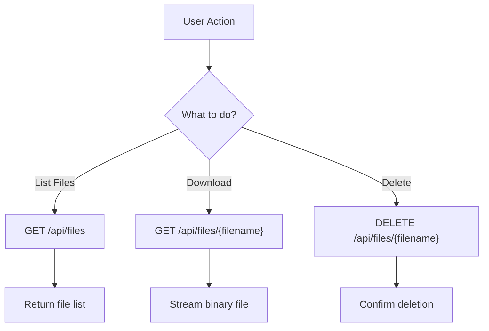

# API Reference

Complete REST API documentation for java-resumes application.

## Table of Contents

- [Base URL](#-base-url)
- [Core Endpoints](#-core-endpoints)
- [Upload & Optimize](#-upload--optimize)
- [File Management](#-file-management)
- [Response Formats](#-response-formats)
- [Error Handling](#-error-handling)
- [Examples](#-examples)

---

## 📡 Base URL

```
http://localhost:8080
```

## 🔗 Core Endpoints

### File Management

#### List All Files

**Endpoint:** `GET /api/files`

**Description:** Retrieve a list of all uploaded and generated files

**Request:**

```bash
curl http://localhost:8080/api/files
```

**Response (200 OK):**

```json
[
  {
    "filename": "resume-optimized.md",
    "url": "/api/files/resume-optimized.md",
    "size": 2048
  },
  {
    "filename": "cover-letter.pdf",
    "url": "/api/files/cover-letter.pdf",
    "size": 51200
  }
]
```

**Response Schema:**

```json
{
  "type": "array",
  "items": {
    "type": "object",
    "properties": {
      "filename": {
        "type": "string",
        "description": "Name of the file"
      },
      "url": {
        "type": "string",
        "description": "Download URL for the file"
      },
      "size": {
        "type": "integer",
        "description": "File size in bytes"
      }
    }
  }
}
```

---

#### Download File

**Endpoint:** `GET /api/files/{filename}`

**Description:** Download a specific file by name

**Parameters:**
| Name | Type | Required | Description |
| ---------- | ------ | -------- | --------------- |
| `filename` | string | Yes | Name of the file|

**Request:**

```bash
curl http://localhost:8080/api/files/resume-optimized.md -o resume.md
curl http://localhost:8080/api/files/cover-letter.pdf -o letter.pdf
```

**Response (200 OK):**

- Binary file content
- Content-Type: application/octet-stream (or appropriate MIME type)
- Content-Disposition: attachment; filename="resume-optimized.md"

**Response (404 Not Found):**

```json
{
  "message": "File not found"
}
```

---

#### Delete File

**Endpoint:** `DELETE /api/files/{filename}`

**Description:** Delete a specific file

**Parameters:**
| Name | Type | Required | Description |
| ---------- | ------ | -------- | --------------- |
| `filename` | string | Yes | Name of the file|

**Request:**

```bash
curl -X DELETE http://localhost:8080/api/files/old-resume.pdf
```

**Response (200 OK):**

```json
{
  "message": "File deleted successfully"
}
```

**Response (404 Not Found):**

```json
{
  "message": "File not found"
}
```

---

### Document Processing

#### Upload & Optimize Resume/Cover Letter

**Endpoint:** `POST /api/upload`

**Description:** Submit resume and job description for optimization using AI

**Request Headers:**

```
Content-Type: application/json
```

**Request Body:**

```json
{
  "jobDescription": "We are looking for a Senior Java Developer with 5+ years...",
  "resume_string": "John Doe\nSenior Software Engineer\n...",
  "promptType": ["RESUME_OPTIMIZATION", "COVER_LETTER"],
  "temperature": 0.7,
  "model": "gemma-3-4b-it"
}
```

**Request Schema:**

```json
{
  "type": "object",
  "required": ["jobDescription", "resume_string"],
  "properties": {
    "jobDescription": {
      "type": "string",
      "description": "Job description text",
      "minLength": 50
    },
    "resume_string": {
      "type": "string",
      "description": "Resume or CV text",
      "minLength": 50
    },
    "promptType": {
      "type": "array",
      "items": {
        "type": "string",
        "enum": ["RESUME_OPTIMIZATION", "COVER_LETTER"]
      },
      "description": "Types of documents to generate"
    },
    "temperature": {
      "type": "number",
      "minimum": 0.0,
      "maximum": 1.0,
      "description": "LLM response creativity (0=deterministic, 1=creative)"
    },
    "model": {
      "type": "string",
      "description": "LLM model to use (e.g., 'gemma-3-4b-it')"
    }
  }
}
```

**Request Example (cURL):**

```bash
curl -X POST http://localhost:8080/api/upload \
  -H "Content-Type: application/json" \
  -d '{
    "jobDescription": "Senior Java Developer - 5+ years required",
    "resume_string": "John Doe, Senior Software Engineer, Java experience",
    "promptType": ["RESUME_OPTIMIZATION"],
    "temperature": 0.7,
    "model": "gemma-3-4b-it"
  }'
```

**Response (202 Accepted):**

```json
{
  "message": "Resume optimization started. Check /api/files for results."
}
```

**Response (400 Bad Request):**

```json
{
  "message": "Invalid request: jobDescription and resume are required"
}
```

**Response (500 Internal Server Error):**

```json
{
  "message": "Error during processing: LLM service unavailable"
}
```

**Processing Notes:**

- Returns 202 Accepted immediately (asynchronous processing)
- Processing happens in background thread
- Poll `GET /api/files` to check for results
- Results appear as new files in file list

---

#### Convert Markdown to PDF

**Endpoint:** `POST /api/markdownFile2PDF`

**Description:** Convert markdown file to PDF format

**Request Headers:**

```
Content-Type: multipart/form-data
```

**Request Parameters:**
| Name | Type | Required | Description |
| ------ | ---- | -------- | ----------------- |
| `file` | file | Yes | Markdown file |

**Request Example (cURL):**

```bash
curl -X POST http://localhost:8080/api/markdownFile2PDF \
  -F "file=@resume.md" \
  --output resume.pdf
```

**Request Example (Browser):**

```html
<form
  action="http://localhost:8080/api/markdownFile2PDF"
  method="post"
  enctype="multipart/form-data"
>
  <input
    type="file"
    name="file"
    accept=".md"
  />
  <button type="submit">Convert to PDF</button>
</form>
```

**Response (200 OK):**

- Binary PDF content
- Content-Type: application/pdf
- Content-Disposition: attachment; filename="resume.pdf"

**Response (400 Bad Request):**

```json
{
  "message": "No file provided or invalid file format"
}
```

**Response (413 Payload Too Large):**

```json
{
  "message": "File size exceeds maximum allowed (500KB)"
}
```

**Response (500 Internal Server Error):**

```json
{
  "message": "Error converting markdown to PDF"
}
```

---

### Interview Preparation _(New)_

#### Generate HR Interview Questions

**Endpoint:** `POST /api/generate/interview-hr-questions`

**Description:** Generate 5 general HR interview questions to prepare for behavioral interviews

**Request Headers:**

```
Content-Type: application/json
```

**Request Body:**

```json
{
  "jobDescription": "Software Engineer position requiring teamwork and communication skills",
  "company_name": "TechCorp" // optional
}
```

**Request Example (cURL):**

```bash
curl -X POST http://localhost:8080/api/generate/interview-hr-questions \
  -H "Content-Type: application/json" \
  -d '{
    "jobDescription": "Senior Software Engineer - Lead development teams",
    "company_name": "TechStartup"
  }'
```

**Response (202 Accepted):**

```json
{
  "message": "Interview questions generation started. Check /api/files for results."
}
```

**Output:** Markdown file with 5 HR interview questions (behavioral, situational, cultural fit)

---

#### Generate Job-Specific Interview Questions

**Endpoint:** `POST /api/generate/interview-job-specific`

**Description:** Generate 5 role-specific technical or functional interview questions based on job description

**Request Headers:**

```
Content-Type: application/json
```

**Request Body:**

```json
{
  "jobDescription": "DevOps Engineer - AWS, Kubernetes, CI/CD experience required",
  "jobTitle": "Senior DevOps Engineer" // optional
}
```

**Request Example (cURL):**

```bash
curl -X POST http://localhost:8080/api/generate/interview-job-specific \
  -H "Content-Type: application/json" \
  -d '{
    "jobDescription": "Full Stack Developer - React, Node.js, MongoDB",
    "jobTitle": "Full Stack Developer"
  }'
```

**Response (202 Accepted):**

```json
{
  "message": "Interview questions generation started. Check /api/files for results."
}
```

**Output:** Markdown file with 5 job-specific technical/functional interview questions

---

#### Generate Reverse Interview Questions

**Endpoint:** `POST /api/generate/interview-reverse`

**Description:** Generate thoughtful questions candidates can ask interviewers to demonstrate engagement

**Request Headers:**

```
Content-Type: application/json
```

**Request Body:**

```json
{
  "jobDescription": "Product Manager - B2B SaaS platform",
  "company_name": "FastGrowth Inc" // optional
}
```

**Request Example (cURL):**

```bash
curl -X POST http://localhost:8080/api/generate/interview-reverse \
  -H "Content-Type: application/json" \
  -d '{
    "jobDescription": "Engineering Manager - Team of 8 developers",
    "company_name": "TechCorp"
  }'
```

**Response (202 Accepted):**

```json
{
  "message": "Interview questions generation started. Check /api/files for results."
}
```

**Output:** Markdown file with 5 strategic questions for candidates to ask during interviews

---

### Professional Networking _(New)_

#### Generate Cold Email

**Endpoint:** `POST /api/generate/cold-email`

**Description:** Generate 5 variations of professional cold outreach emails to target companies

**Request Headers:**

```
Content-Type: application/json
```

**Request Body:**

```json
{
  "jobDescription": "Software Engineer - Python, Machine Learning",
  "company_name": "AI Innovations Inc",
  "jobTitle": "ML Engineer" // optional
}
```

**Request Example (cURL):**

```bash
curl -X POST http://localhost:8080/api/generate/cold-email \
  -H "Content-Type: application/json" \
  -d '{
    "jobDescription": "Senior Data Scientist - NLP and Computer Vision",
    "company_name": "DataTech Solutions",
    "jobTitle": "Senior Data Scientist"
  }'
```

**Response (202 Accepted):**

```json
{
  "message": "Cold email generation started. Check /api/files for results."
}
```

**Output:** Markdown file with 5 distinct professional cold email templates

---

#### Generate LinkedIn Message

**Endpoint:** `POST /api/generate/cold-linkedin-message`

**Description:** Generate 5 variations of LinkedIn connection request messages for professional networking

**Request Headers:**

```
Content-Type: application/json
```

**Request Body:**

```json
{
  "jobDescription": "Product Designer - UX/UI for mobile apps",
  "company_name": "DesignHub",
  "jobTitle": "Senior Product Designer" // optional
}
```

**Request Example (cURL):**

```bash
curl -X POST http://localhost:8080/api/generate/cold-linkedin-message \
  -H "Content-Type: application/json" \
  -d '{
    "jobDescription": "Frontend Developer - React, TypeScript",
    "company_name": "WebDev Inc",
    "jobTitle": "Frontend Developer"
  }'
```

**Response (202 Accepted):**

```json
{
  "message": "LinkedIn message generation started. Check /api/files for results."
}
```

**Output:** Markdown file with 5 distinct LinkedIn outreach message variations

---

#### Generate Thank You Email

**Endpoint:** `POST /api/generate/thank-you-email`

**Description:** Generate 5 variations of post-interview thank you emails

**Request Headers:**

```
Content-Type: application/json
```

**Request Body:**

```json
{
  "jobDescription": "Backend Engineer - Go, Docker, Kubernetes",
  "company_name": "CloudFirst Technologies",
  "jobTitle": "Backend Engineer", // optional
  "interviewerName": "Sarah Johnson" // optional
}
```

**Request Example (cURL):**

```bash
curl -X POST http://localhost:8080/api/generate/thank-you-email \
  -H "Content-Type: application/json" \
  -d '{
    "jobDescription": "Solutions Architect - AWS, Azure",
    "company_name": "Cloud Services Corp",
    "jobTitle": "Solutions Architect",
    "interviewerName": "Michael Chen"
  }'
```

**Response (202 Accepted):**

```json
{
  "message": "Thank you email generation started. Check /api/files for results."
}
```

**Output:** Markdown file with 5 distinct thank you email variations

---

### System

#### Health Check

**Endpoint:** `GET /api/health`

**Description:** Check if application is running and healthy

**Request:**

```bash
curl http://localhost:8080/api/health
```

**Response (200 OK):**

```json
{
  "status": "UP"
}
```

**Response (503 Service Unavailable):**

```json
{
  "status": "DOWN"
}
```

---

## 📝 Request Examples

### Example 1: Simple Resume Optimization

```bash
curl -X POST http://localhost:8080/api/upload \
  -H "Content-Type: application/json" \
  -d '{
    "jobDescription": "Software Engineer - Java, Spring Boot, Microservices",
    "resume_string": "John Doe\nSenior Java Developer\n10 years experience",
    "promptType": ["RESUME_OPTIMIZATION"],
    "temperature": 0.7
  }'
```

### Example 2: Resume + Cover Letter

```bash
curl -X POST http://localhost:8080/api/upload \
  -H "Content-Type: application/json" \
  -d '{
    "jobDescription": "Product Manager at TechCorp",
    "resume_string": "Jane Smith\nProduct Manager\n8 years tech experience",
    "promptType": ["RESUME_OPTIMIZATION", "COVER_LETTER"],
    "temperature": 0.8
  }'
```

### Example 3: List Files and Download

```bash
# List all files
curl http://localhost:8080/api/files

# Download specific file
curl http://localhost:8080/api/files/resume-optimized.md > resume.md

# Delete file
curl -X DELETE http://localhost:8080/api/files/old-resume.pdf
```

### Example 4: Markdown to PDF

```bash
# Create sample markdown
echo "# My Resume
## Experience
10 years as Software Engineer" > resume.md

# Convert to PDF
curl -X POST http://localhost:8080/api/markdownFile2PDF \
  -F "file=@resume.md" \
  --output resume.pdf
```

---

## 🔄 API Workflow

### Typical Resume Optimization Workflow

```mermaid
graph TD
    A["1. POST /api/upload"] -->|202 Accepted| B["Client receives confirmation"]
    B --> C["2. Background processing starts"]
    C --> D["3. LLM generates optimized resume"]
    D --> E["4. Files saved to storage"]
    E --> F["5. User polls GET /api/files"]
    F --> G{New Files?}
    G -->|Yes| H["6. Display results"]
    G -->|No| I["7. Wait and poll again"]
    I -->|After 2-5s| F
    H --> J["8. User downloads file"]
    J -->|GET /api/files/{filename}| K["Receive binary file"]
```

### File Management Workflow



---

## ⚙️ Parameters & Configuration

### Optimization Parameters

| Parameter        | Type   | Default           | Range   | Description              |
| ---------------- | ------ | ----------------- | ------- | ------------------------ |
| `temperature`    | number | 0.7               | 0.0-1.0 | Response creativity      |
| `model`          | string | gemma-3-4b-it     | -       | LLM model name           |
| `jobDescription` | string | required          | -       | Target job posting       |
| `resume`         | string | required          | -       | Current resume text      |
| `promptType`     | array  | ["resume_string"] | -       | Output types to generate |

### File Size Limits

| Item                  | Limit  |
| --------------------- | ------ |
| Single file upload    | 500 KB |
| Total request size    | 5 MB   |
| Markdown to PDF input | 500 KB |

---

## ❌ Error Handling

### HTTP Status Codes

| Code | Meaning               | Example                        |
| ---- | --------------------- | ------------------------------ |
| 200  | OK                    | File download successful       |
| 202  | Accepted              | Optimization started (async)   |
| 400  | Bad Request           | Missing required parameter     |
| 404  | Not Found             | File or endpoint doesn't exist |
| 413  | Payload Too Large     | File exceeds size limit        |
| 500  | Internal Server Error | LLM service error              |
| 503  | Service Unavailable   | Backend or LLM service down    |

### Common Error Messages

```json
{
  "message": "No file/invalid file provided."
}
```

```json
{
  "message": "Required property missing or invalid."
}
```

```json
{
  "message": "Error during processing: LLM service unavailable"
}
```

---

## 📚 Interactive API Documentation

### Swagger/OpenAPI

Visit the interactive API documentation at:

```
http://localhost:8080/swagger-ui/index.html
```

**Features:**

- Try endpoints directly
- View request/response schemas
- See example requests
- Download OpenAPI specification

---

## 🔐 Authentication (Future)

**Note:** Current version has no authentication. Production deployment should add:

- API key authentication
- OAuth 2.0 support
- JWT tokens
- Role-based access control

---

## 📊 Response Times

Typical response times (with Ollama local LLM):

| Operation                      | Time   |
| ------------------------------ | ------ |
| GET /api/files                 | <100ms |
| GET /api/files/{filename}      | <200ms |
| DELETE /api/files/{filename}   | <100ms |
| POST /api/upload (submitted)   | <200ms |
| Resume processing (background) | 10-30s |
| POST /api/markdownFile2PDF     | 2-5s   |
| GET /api/health                | <50ms  |

---

## 💡 Best Practices

### Rate Limiting

**Recommended for production:**

- Limit to 10 requests per minute per IP
- Batch operations for bulk processing
- Implement exponential backoff for retries

### Caching

**Recommendations:**

- Cache file listings (5-10 seconds)
- Cache LLM responses (if same inputs)
- Invalidate on new uploads/deletes

### Error Handling

**Client should:**

- Retry on 5xx errors with exponential backoff
- Display user-friendly error messages
- Log full response for debugging
- Handle timeouts gracefully

### Polling Strategy

**For resume optimization:**

- Poll every 2-3 seconds initially
- Increase interval after 10 seconds
- Give up after 5 minutes with error
- Show progress indicator to user

---

**See also:**

- [Quick Start](QUICK_START.md) - API usage examples
- [Architecture](ARCHITECTURE.md) - Backend architecture
- [Testing](TESTING.md) - API testing guide

---

**Last Updated:** February 2, 2026
**Maintained By:** java-resumes development team

---

**Last Updated:** February 2, 2026
**Maintained By:** java-resumes development team
