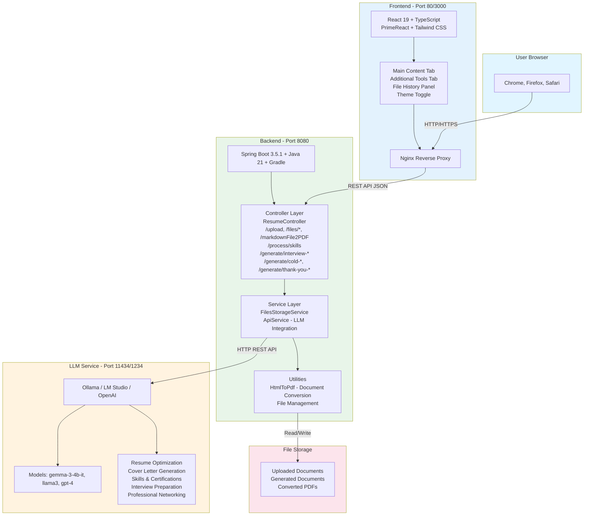
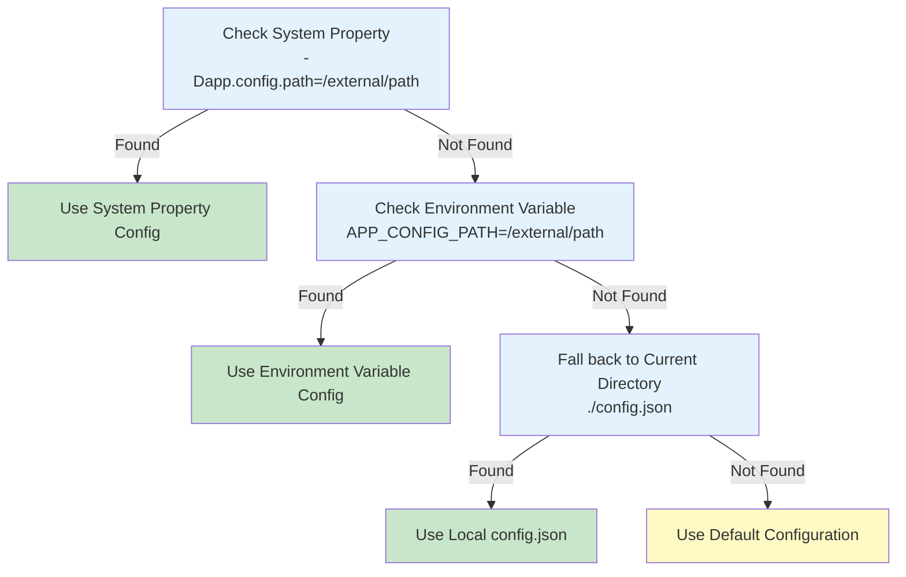
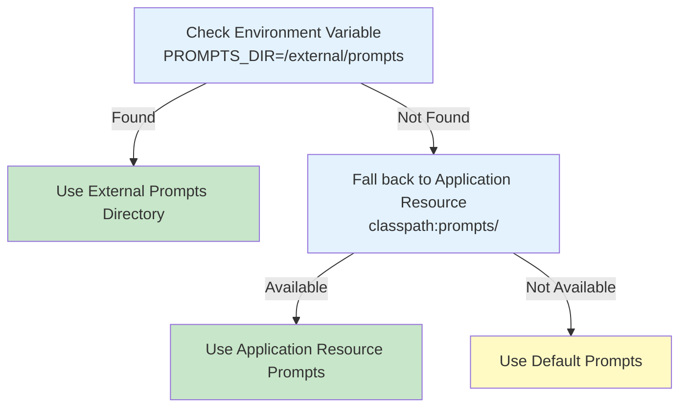

# System Architecture

The java-resumes application is built with a modern full-stack architecture that separates concerns across frontend, backend, and external services.

- [System Architecture](#system-architecture)
  - [High-Level Architecture](#high-level-architecture)
  - [Request Flow Architecture](#request-flow-architecture)
  - [Container Network Architecture](#container-network-architecture)
  - [Component Architecture](#component-architecture)
    - [Frontend Layer](#frontend-layer)
    - [Backend Layer](#backend-layer)
    - [LLM Service Layer](#llm-service-layer)
  - [Data Flow Diagrams](#data-flow-diagrams)
    - [Resume Optimization Flow](#resume-optimization-flow)
    - [File Management Flow](#file-management-flow)
  - [External Configuration Integration](#external-configuration-integration)
    - [Configuration Path Resolution](#configuration-path-resolution)
    - [External Prompts Directory](#external-prompts-directory)
  - [Security Considerations](#security-considerations)
    - [Input Validation](#input-validation)
    - [File Handling](#file-handling)
    - [API Security](#api-security)
  - [Deployment Architecture](#deployment-architecture)
    - [Docker Compose Deployment](#docker-compose-deployment)
    - [Kubernetes Deployment (Future)](#kubernetes-deployment-future)
  - [Extensibility Points](#extensibility-points)
    - [Adding New LLM Providers](#adding-new-llm-providers)
    - [Adding New Document Types](#adding-new-document-types)
    - [Custom Prompt Templates](#custom-prompt-templates)
  - [Performance Considerations](#performance-considerations)
    - [Async Processing](#async-processing)
    - [Caching](#caching)
    - [Resource Optimization](#resource-optimization)
  - [Testing Architecture](#testing-architecture)
    - [Backend Testing Strategy](#backend-testing-strategy)
    - [Frontend Testing Strategy](#frontend-testing-strategy)
  - [Key Design Patterns](#key-design-patterns)
    - [MVC Pattern](#mvc-pattern)
    - [Service Layer Pattern](#service-layer-pattern)
    - [Repository Pattern (Future)](#repository-pattern-future)
    - [Strategy Pattern (LLM Integration)](#strategy-pattern-llm-integration)

---

## 🏗️ High-Level Architecture



## 🔄 Request Flow Architecture


## 🌐 Container Network Architecture


## Component Architecture

### Frontend Layer

**Purpose:** User interface and client-side logic

**Technology Stack:**

- React 19 - Component framework
- TypeScript 5.9.3 - Type-safe development
- PrimeReact 10.9.7 - UI components
- Tailwind CSS 4.1.18 - Styling
- Axios - HTTP client

**Key Components:**

- `MainContentTab` - Primary resume optimization interface
- `FileHistoryPanel` - File management and download
- `ToolsTab` - Markdown to PDF conversion
- `ThemeToggle` - Light/dark theme switcher

**Responsibilities:**

- Collect user input (job descriptions, resumes)
- Display processing status
- Show generated documents
- Manage file downloads
- Theme management

### Backend Layer

**Purpose:** Business logic and API endpoints

**Technology Stack:**

- Spring Boot 3.5.1 - Application framework
- Java 21 - Programming language
- Gradle 8.7 - Build tool
- Gson - JSON serialization

**Key Components:**

- `ResumeController` - REST API endpoints
- `ApiService` - LLM integration
- `FilesStorageService` - File operations
- `BackgroundResume` - Async processing thread

**Responsibilities:**

- Validate API requests
- Process resume optimization
- Manage file uploads/downloads
- Coordinate with LLM service
- Handle errors and logging

### LLM Service Layer

**Purpose:** AI-powered document optimization

**Supported Services:**

- Ollama (local, free)
- LM Studio (local, free)
- OpenAI API (cloud-based)

**Capabilities:**

- Resume optimization
- Cover letter generation
- Skills & certifications recommendations
- Interview preparation questions (HR, job-specific, reverse)
- Professional networking (cold emails, LinkedIn messages, thank you notes)
- Content restructuring

**Configuration:**

- Endpoint URL (configurable via `config.json` or external path)
- API key (if required)
- Model selection (configurable)

## Data Flow Diagrams

### Resume Optimization Flow


### File Management Flow


## External Configuration Integration

The architecture supports external configuration paths for enhanced flexibility:

### Configuration Path Resolution



### External Prompts Directory



## Security Considerations

### Input Validation

- All user inputs validated on backend
- File size limits enforced
- CORS properly configured for frontend

### File Handling

- Files stored outside web root
- Temporary files cleaned up after processing
- Filename sanitization to prevent directory traversal

### API Security

- No authentication required for demo (add for production)
- CORS headers properly configured
- HTTPS recommended for production

## Deployment Architecture

### Docker Compose Deployment

```yaml
Services:
  - Frontend: nginx:alpine (Port 80)
  - Backend: eclipse-temurin:21-jre (Port 8080)
  - Network: resume-app-network (shared)
  - Volume: backend-files (persistent)

External Services:
  - LLM Service: localhost:11434 (Ollama) or 1234 (LM Studio)
```

### Kubernetes Deployment (Future)

```plaintext
Namespace: java-resumes
Deployments:
  - frontend-deployment (replicas: 2)
  - backend-deployment (replicas: 2)
Services:
  - frontend-service (ClusterIP)
  - backend-service (ClusterIP)
ConfigMaps:
  - app-config (config.json)
Persistent Volumes:
  - file-storage
```

## Extensibility Points

### Adding New LLM Providers

1. Create new provider class implementing `LLMProvider` interface
2. Add configuration in `config.json`
3. Update `ApiService` with provider detection logic

### Adding New Document Types

1. Create new prompt template in `prompts/` directory
2. Add new endpoint to `ResumeController` (e.g., `/api/generate/new-type`)
3. Use `processPromptRequest()` helper method with prompt type identifier
4. Update frontend UI if user-facing (or use API directly)
5. Document in API_REFERENCE.md and update README.md

**Example**: Interview and networking prompts added in this release:

- Interview preparation endpoints (hr-questions, job-specific, reverse)
- Networking endpoints (cold-email, linkedin-message, thank-you-email)

### Custom Prompt Templates

1. Create prompt file in `prompts/` directory (e.g., `NEW_TYPE.md`)
2. Follow existing prompt structure (clear instructions, input parameters, output format)
3. Load via `PromptService.loadPrompt("NEW_TYPE")`
4. Add controller endpoint using `processPromptRequest()`
5. Test with sample data to validate outputs

**Current Prompt Templates**:

- `RESUME.md` - Resume optimization
- `COVER.md` - Cover letter generation
- `SKILLS.md` - Skills & certifications recommendations
- Interview preparation prompts (hr-questions, job-specific, reverse)
- Networking prompts (cold-email, linkedin-message, thank-you-email)

## Performance Considerations

### Async Processing

- Long-running LLM requests run in background threads
- Frontend polls for results instead of blocking
- Prevents server timeout for large documents

### Caching

- Configuration cached on application startup
- File listings cached in memory
- Consider Redis for distributed caching

### Resource Optimization

- File streaming for large uploads
- Temporary file cleanup
- Connection pooling for external services

## Testing Architecture

### Backend Testing Strategy

- Unit tests: Individual method functionality
- Integration tests: API endpoint behavior
- Mock external services (LLM, file storage)

### Frontend Testing Strategy

- Component tests: React component behavior
- Hook tests: Custom React hooks
- Service tests: API integration mocking

## Key Design Patterns

### MVC Pattern

- **Model**: Data models (Optimize, FileInfo)
- **View**: React components
- **Controller**: Spring REST controllers

### Service Layer Pattern

- Separates business logic from controllers
- Facilitates testing through mocking
- Promotes code reusability

### Repository Pattern (Future)

- Abstract data access
- Support multiple storage backends
- Facilitate database addition

### Strategy Pattern (LLM Integration)

- Different LLM providers (Ollama, OpenAI)
- Pluggable LLM selection
- Easy to add new providers

---

**See also:**

- [Configuration Guide](CONFIGURATION.md) - External config setup
- [API Reference](API_REFERENCE.md) - Endpoint documentation
- [Development Setup](DEVELOPMENT_SETUP.md) - Development environment
