# Java Resumes - Architecture Documentation

## Table of Contents

1. [1000ft Process View](#1000ft-process-view)
2. [Sequence Diagram](#sequence-diagram)
3. [Detailed Process View](#detailed-process-view)
4. [Class Dependency Diagram](#class-dependency-diagram)
5. [Component Interactions](#component-interactions)
6. [Data Models](#data-models)
7. [API Contract](#api-contract)

---

## 1000ft Process View

High-level overview showing main system components and data flow:

```mermaid
graph LR
    User["👤 User<br/>Web Browser"]
    UI["🖥️ Web UI<br/>React + TypeScript<br/>Spotlight"]
    API["🔌 REST API<br/>Spring Boot<br/>Controller"]
    Processor["⚙️ Processor<br/>Background Thread<br/>BackgroundResume"]
    LLM["🤖 LLM Service<br/>Ollama/LM Studio<br/>OpenAI API"]
    Storage["💾 File Storage<br/>Local Filesystem"]

    User -->|interacts| UI
    UI -->|HTTP| API
    API -->|spawn| Processor
    Processor -->|HTTP| LLM
    LLM -->|JSON Response| Processor
    Processor -->|save| Storage
    API -->|read/write| Storage
    API -->|return| UI
    UI -->|display| User

    style User fill:#e1f5ff
    style UI fill:#f3e5f5
    style API fill:#fff3e0
    style Processor fill:#e8f5e9
    style LLM fill:#fce4ec
    style Storage fill:#f1f8e9
```

**Key Components**:

- **User**: Interacts via web browser
- **Web UI (Spotlight)**: React-based frontend
- **REST API**: Spring Boot controller handling HTTP requests
- **Processor**: Background thread for async optimization
- **LLM Service**: OpenAI-compatible AI model
- **File Storage**: Local filesystem for uploads/downloads

---

## Sequence Diagram

Detailed sequence of interactions during a resume optimization request:

**Key Sequences**:

1. **Upload Phase**: User submits resume and job description
2. **Validation Phase**: Server validates request
3. **Async Processing**: Background thread created for optimization
4. **LLM Integration**: Communication with LLM service
5. **Output Generation**: Optimized documents created
6. **File Storage**: Results saved to filesystem
7. **Retrieval Phase**: User downloads completed files

---

## Detailed Process View

Process flow showing interaction between major layers:

**Layer Responsibilities**:

| Layer         | Components                   | Purpose                          |
| ------------- | ---------------------------- | -------------------------------- |
| **Client**    | Web Browser                  | User interface                   |
| **REST**      | AdvancedController           | HTTP endpoints & request routing |
| **Service**   | FilesStorageService          | File operations abstraction      |
| **Model**     | POJO classes                 | Data transfer & validation       |
| **Optimizer** | ApiService, BackgroundResume | LLM integration & processing     |
| **External**  | LLM Service                  | AI model execution               |
| **Storage**   | File System                  | Persistent data storage          |

---

## Class Dependency Diagram

Detailed class relationships and dependencies:

```mermaid
graph TB
    subgraph Controllers["Controllers"]
        AC["AdvancedController<br/>─────────<br/>+ file2PDF()<br/>+ uploadFiles()<br/>+ getListFiles()<br/>+ downloadFile()<br/>+ deleteFile()"]
    end

    subgraph Services["Services"]
        FSS["FilesStorageService<br/>«interface»<br/>─────────<br/>+ init()<br/>+ save()<br/>+ load()<br/>+ delete()<br/>+ loadAll()"]
        FSSI["FilesStorageServiceImpl<br/>─────────<br/>+ init()<br/>+ save()<br/>+ load()<br/>+ delete()<br/>+ loadAll()"]
    end

    subgraph Models["Models"]
        Opt["Optimize<br/>─────────<br/>- promptType: String[]<br/>- temperature: double<br/>- model: String<br/>- resume: String<br/>- jobDescription: String<br/>- jobTitle: String<br/>- company: String"]
        FI["FileInfo<br/>─────────<br/>- filename: String<br/>- url: String<br/>- size: long"]
        RM["ResponseMessage<br/>─────────<br/>- message: String"]
    end

    subgraph Optimizers["Optimizers"]
        BR["BackgroundResume<br/>«Runnable»<br/>─────────<br/>- optimize: Optimize<br/>- endpoint: String<br/>- apikey: String<br/>- root: String<br/>+ run()"]
        AS["ApiService<br/>─────────<br/>- jobDescription: String<br/>- resume: String<br/>+ produceFiles()<br/>+ createChatBody()<br/>+ sendHttpRequest()<br/>+ processResponse()"]
        HTP["HtmlToPdf<br/>─────────<br/>- inputFile: String<br/>- outputFile: String<br/>- options: String<br/>+ convertFile()"]
    end

    subgraph ResponseModels["Response Models"]
        LR["LLMResponse<br/>─────────<br/>- model: String<br/>- choices: List<Choice><br/>- usage: Usage"]
        Ch["Choice<br/>─────────<br/>- message: Message<br/>- index: int"]
        Msg["Message<br/>─────────<br/>- role: String<br/>- content: String"]
        Us["Usage<br/>─────────<br/>- prompt_tokens: int<br/>- completion_tokens: int<br/>- total_tokens: int"]
    end

    subgraph RequestModels["Request Models"]
        CB["ChatBody<br/>─────────<br/>- model: String<br/>- messages: List<Message><br/>- temperature: double<br/>- stream: boolean"]
    end

    subgraph Config["Configuration"]
        Cfg["Config<br/>─────────<br/>- endpoint: String<br/>- apikey: String"]
    end

    subgraph Utilities["Utilities"]
        Util["Utility<br/>─────────<br/>+ readFileAsString()<br/>+ convertLineEndings()<br/>+ removeFileExtension()"]
    end

    AC -->|uses| FSS
    AC -->|uses| Opt
    AC -->|uses| HTP
    AC -->|creates| RM
    AC -->|returns| FI

    FSSI -.->|implements| FSS

    BR -->|contains| Opt
    BR -->|uses| AS
    BR -->|uses| Cfg
    BR -->|uses| Util

    AS -->|receives| Opt
    AS -->|creates| CB
    AS -->|receives| LR
    AS -->|uses| HTP

    CB -->|contains| Msg
    LR -->|contains| Ch
    Ch -->|contains| Msg
    LR -->|contains| Us

    HTP -->|creates| FI

    Cfg -->|reads via| Util

    style Controllers fill:#fff3e0
    style Services fill:#f3e5f5
    style Models fill:#e8f5e9
    style Optimizers fill:#fce4ec
    style ResponseModels fill:#ffe0b2
    style RequestModels fill:#f1f8e9
    style Config fill:#c8e6c9
    style Utilities fill:#d1c4e9
```

**Key Relationships**:

- **AdvancedController** → FilesStorageService: Dependency injection
- **FilesStorageServiceImpl** → FilesStorageService: Interface implementation
- **BackgroundResume** → ApiService: Delegates LLM operations
- **ApiService** → LLMResponse: Parses API responses
- **ApiService** → HtmlToPdf: Converts outputs to PDF

---

## Component Interactions

### File Upload & Processing Flow

---

## Data Models

### Optimize Request Model

### FileInfo Response Model

### LLMResponse Model

---

## API Contract

### REST Endpoint Specification

### Key Endpoints

| HTTP       | Endpoint            | Payload                                     | Response                    |
| ---------- | ------------------- | ------------------------------------------- | --------------------------- |
| **POST**   | `/upload`           | Multi-part form: resume, job, optimize JSON | `{"message": "generating"}` |
| **GET**    | `/files`            | None                                        | `List<FileInfo>`            |
| **GET**    | `/files/{filename}` | Path parameter: filename                    | File content (binary)       |
| **DELETE** | `/files/{filename}` | Path parameter: filename                    | `{"message": "deleted"}`    |
| **POST**   | `/delete-all`       | None                                        | `{"message": "deleted"}`    |
| **POST**   | `/markdownFile2PDF` | Multi-part form: file                       | `{"message": "converted"}`  |

---

## Technology Mapping

---

## Deployment Architecture

---

## Summary

This architecture provides:

1. **Scalability**: Background processing prevents blocking
2. **Modularity**: Clear separation of concerns
3. **Maintainability**: Layered architecture with interfaces
4. **Flexibility**: Multiple file format support
5. **Integration**: Easy LLM service switching
6. **Testing**: Comprehensive unit test coverage

For detailed implementation, see [../docs/README.md](./README.md)
