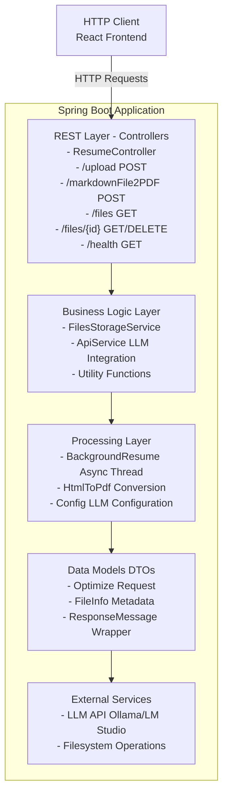
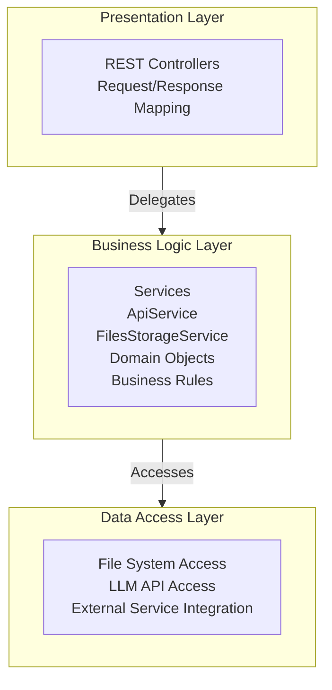
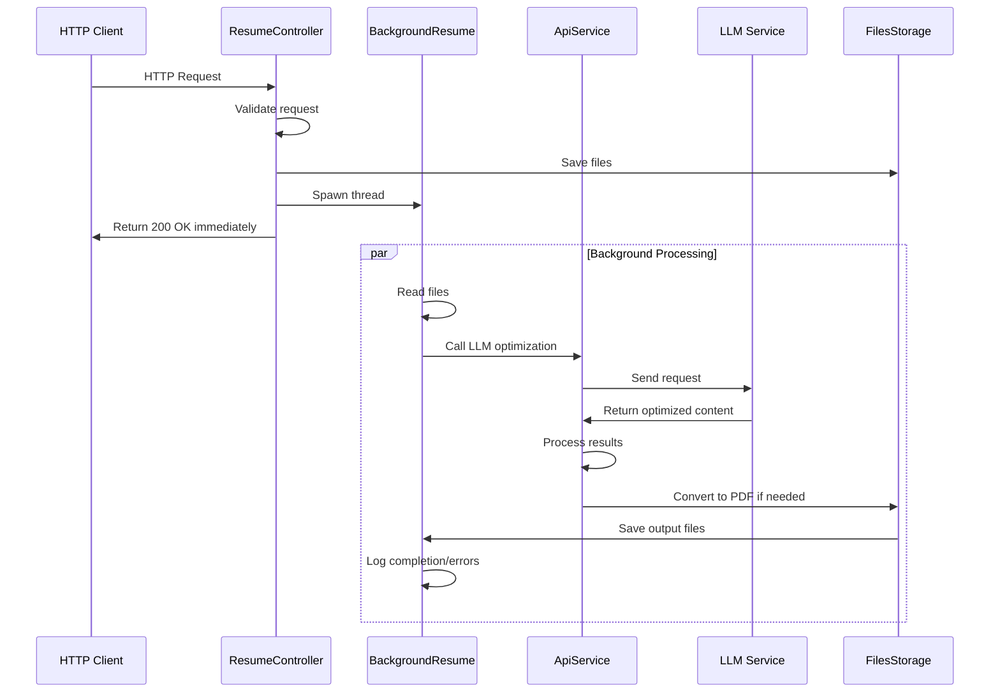
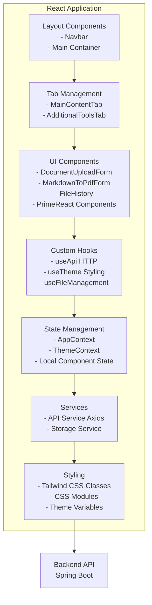
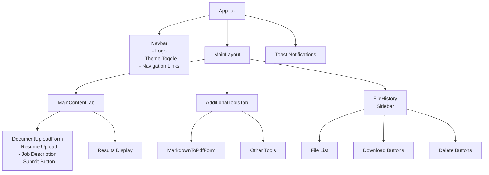
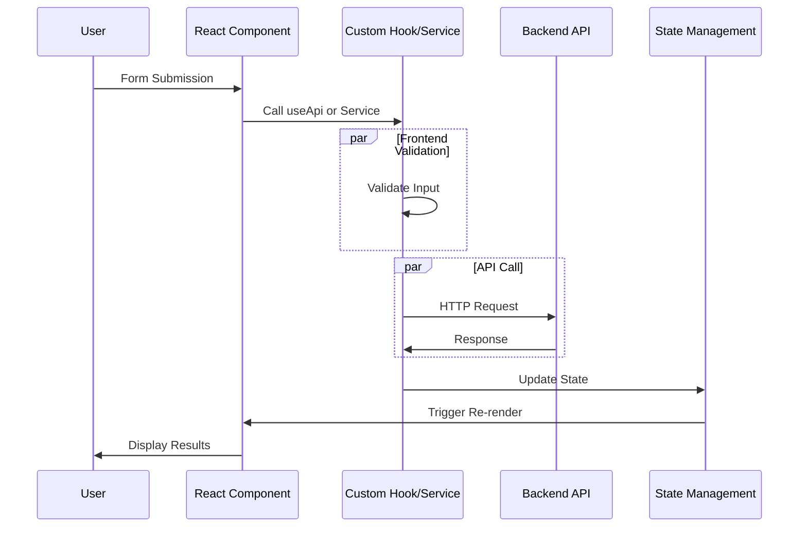
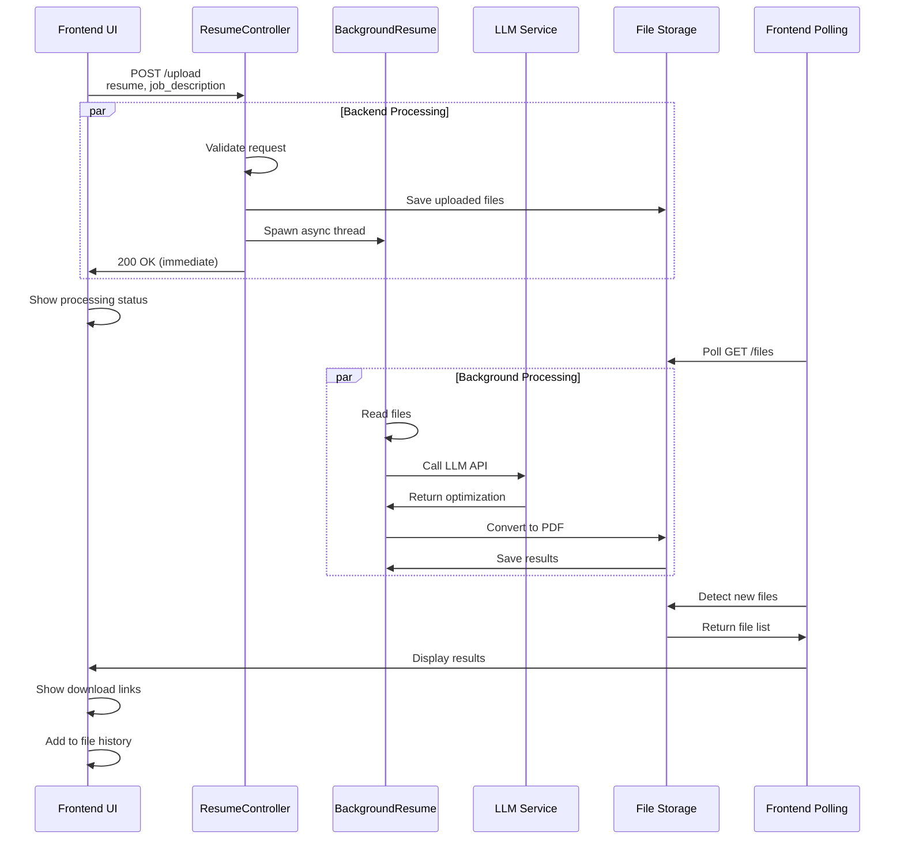
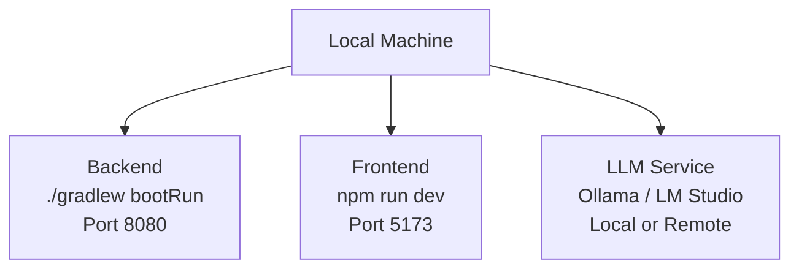
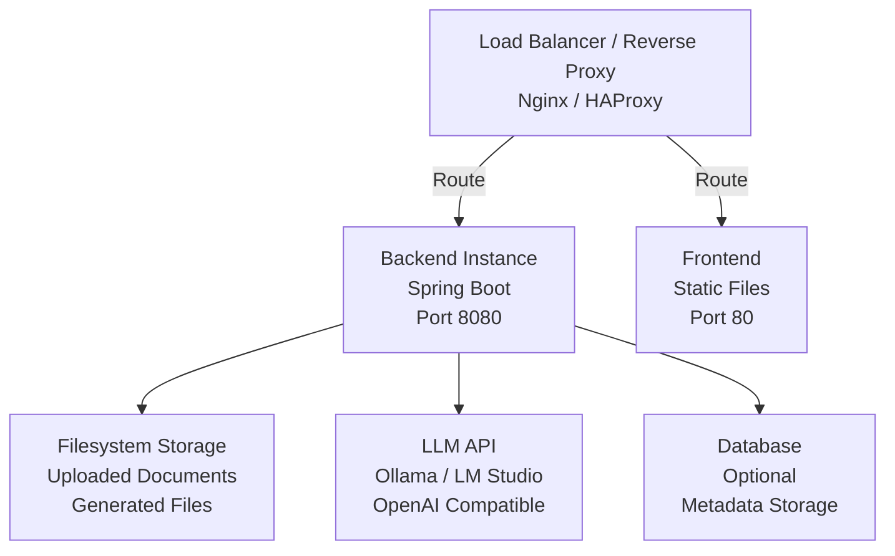

# 🏗️ System Architecture

Complete architecture documentation for the java-resumes project, covering both backend and frontend systems.

---

- [🏗️ System Architecture](#️-system-architecture)
  - [👋 Overview](#-overview)
    - [✨ Key Characteristics](#-key-characteristics)
  - [🔙 Backend Architecture](#-backend-architecture)
    - [📊 High-Level Structure](#-high-level-structure)
    - [📦 Core Components](#-core-components)
      - [🎛️ ResumeController](#️-resumecontroller)
      - [🧵 BackgroundResume](#-backgroundresume)
      - [🔌 ApiService](#-apiservice)
      - [💾 FilesStorageService](#-filesstorageservice)
      - [📄 HtmlToPdf](#-htmltopdf)
    - [📋 Data Models](#-data-models)
    - [🏢 Layers](#-layers)
    - [⏱️ Asynchronous Processing](#️-asynchronous-processing)
  - [🎨 Frontend Architecture](#-frontend-architecture)
    - [📊 High-Level Structure](#-high-level-structure-1)
    - [🧹 Component Structure](#-component-structure)
    - [🌤️ Custom Hooks](#️-custom-hooks)
    - [🗓️ State Management](#️-state-management)
    - [📊 Data Flow](#-data-flow)
    - [🦩 Component Types](#-component-types)
  - [🔗 Integration \& Data Flow](#-integration--data-flow)
    - [📄 Document Processing Flow](#-document-processing-flow)
    - [🔄 API Contracts](#-api-contracts)
  - [🚀 Deployment Architecture](#-deployment-architecture)
    - [💻 Development Environment](#-development-environment)
    - [🌐 Production Environment](#-production-environment)
    - [🚢 Container Deployment](#-container-deployment)
  - [📚 Technology Stack](#-technology-stack)
    - [🔙 Backend](#-backend)
    - [🎨 Frontend](#-frontend)
    - [🌐 External Services](#-external-services)
  - [🎯‍♀️ Design Patterns](#️-design-patterns)
    - [🔙 Backend Patterns](#-backend-patterns)
    - [🎨 Frontend Patterns](#-frontend-patterns)
  - [🚀 Scalability Considerations](#-scalability-considerations)
    - [🔙 Backend Scaling](#-backend-scaling)
    - [🎨 Frontend Optimization](#-frontend-optimization)
    - [💾 Database Scaling](#-database-scaling)
  - [🔐 Security Considerations](#-security-considerations)
    - [🔙 Backend](#-backend-1)
    - [🎨 Frontend](#-frontend-1)
    - [🔏 Data Protection](#-data-protection)
  - [👀 Monitoring \& Observability](#-monitoring--observability)
    - [🔙 Backend](#-backend-2)
    - [🎨 Frontend](#-frontend-2)
    - [📊 Key Metrics](#-key-metrics)
  - [📚 References](#-references)

---

## 👋 Overview

**java-resumes** is a full-stack application for AI-powered resume and cover letter optimization. The system consists of:

- 🔙 **Backend**: Spring Boot REST API for document processing and LLM integration
- 🎨 **Frontend**: React SPA for user interface and document management
- 🤖 **LLM Integration**: Integration with Ollama/LM Studio for AI optimization

### ✨ Key Characteristics

- ⚡ **Stateless Architecture**: Backend designed for horizontal scaling
- 🔄 **Asynchronous Processing**: Long-running operations handled off the main thread
- ⚡ **Responsive Frontend**: React-based UI with real-time status updates
- 💾 **File-Based Storage**: Documents stored on filesystem for simplicity
- 🤖 **AI-Powered**: Leverages LLM endpoints for intelligent document optimization

---

## 🔙 Backend Architecture

### 📊 High-Level Structure



### 📦 Core Components

#### 🎛️ ResumeController

**Responsibility**: REST API endpoints

**Endpoints**:

- `POST /upload` - Process resume/cover letter with optimization request
- `POST /markdownFile2PDF` - Convert markdown/HTML to PDF
- `GET /files` - List uploaded files
- `GET /files/{filename}` - Download file
- `DELETE /files/{filename}` - Delete file
- `POST /delete-all` - Clear all uploads
- `GET /health` - Health check

**Key Features**:

- CORS enabled for React frontend
- Request validation before processing
- Asynchronous processing via BackgroundResume threads
- Proper HTTP status codes and error messages

#### 🧵 BackgroundResume

**Responsibility**: Asynchronous document optimization

**Process**:

1. Receives optimization request
2. Reads resume file from storage
3. Calls ApiService for LLM optimization
4. Processes and converts to PDF if needed
5. Stores result files
6. Completes without blocking REST request

**Key Features**:

- Spawned as separate thread from controller
- Handles long-running operations
- Error handling and logging
- File I/O operations

#### 🔌 ApiService

**Responsibility**: Integration with LLM endpoints

**Features**:

- HTTP communication with Ollama/LM Studio
- ChatGPT-compatible API format
- Request/response handling
- Error handling and retries
- Configurable endpoints and models

**API Pattern**:

```
POST {LLM_ENDPOINT}/api/chat
{
  "model": "model_name",
  "messages": [{"role": "user", "content": "prompt"}],
  "temperature": 0.7,
  "top_p": 0.9
}
```

#### 💾 FilesStorageService

**Responsibility**: File system operations

**Methods**:

- Save uploaded files
- Retrieve file metadata
- List available files
- Delete files
- Ensure upload directory exists

**Implementation**:

- Uses `application.yml` for upload directory configuration
- Error handling for file operations
- Logging for audit trail

#### 📄 HtmlToPdf

**Responsibility**: Markdown/HTML to PDF conversion

**Process**:

1. Accept markdown or HTML input
2. Convert to intermediate format (CommonMark)
3. Render to PDF (Flying Saucer)
4. Return PDF bytes or save to file

### 📋 Data Models

**Optimize (Request DTO)**:

```java
@JsonNaming(PropertyNamingStrategies.SnakeCaseStrategy.class)
class Optimize {
  String resume;           // Resume content
  String jobDescription;   // Job description for context
  String coverLetter;      // Cover letter (optional)
  String outputType;       // "resume", "cover_letter", or "both"
  String llmModel;         // LLM model to use
}
```

**FileInfo (Metadata)**:

```java
class FileInfo {
  String id;               // File identifier
  String filename;         // Original filename
  String uploadedAt;       // Upload timestamp
  Long size;               // File size in bytes
  String type;             // File type (resume, cover_letter, pdf, etc.)
}
```

### 🏢 Layers



### ⏱️ Asynchronous Processing



---

## 🎨 Frontend Architecture

### 📊 High-Level Structure



### 🧹 Component Structure



### 🌤️ Custom Hooks

**useApi Hook**:

```typescript
const useApi = (endpoint: string, method = "GET") => {
  const [data, setData] = useState(null);
  const [loading, setLoading] = useState(false);
  const [error, setError] = useState(null);

  const execute = async (payload?: any) => {
    setLoading(true);
    try {
      const response = await axios({
        method,
        url: `${import.meta.env.VITE_API_URL}${endpoint}`,
        data: payload,
      });
      setData(response.data);
    } catch (err) {
      setError(err.message);
    } finally {
      setLoading(false);
    }
  };

  return { data, loading, error, execute };
};
```

**useTheme Hook**:

```typescript
const useTheme = () => {
  const [theme, setTheme] = useState(
    () => localStorage.getItem("theme") || "light",
  );

  useEffect(() => {
    localStorage.setItem("theme", theme);
    document.documentElement.setAttribute("data-theme", theme);
  }, [theme]);

  return {
    theme,
    toggleTheme: () => setTheme((t) => (t === "light" ? "dark" : "light")),
  };
};
```

### 🗓️ State Management

**AppContext**:

- File operations (upload, delete, list)
- API communication
- Loading states
- Error handling

**ThemeContext**:

- Current theme (light/dark)
- Theme toggle function
- CSS variable injection

**Local State**:

- Component-specific UI state (form inputs, dropdowns)
- Temporary data (search filters, sorting)

### 📊 Data Flow



### 🦩 Component Types

**Container Components**:

- `App.tsx` - Main app wrapper
- `MainLayout` - Primary layout
- Manage state and pass props to children

**Presentational Components**:

- `Navbar` - Top navigation
- `FileHistory` - File list display
- `DocumentUploadForm` - Form inputs
- Receive props, display UI, emit events

**Custom Hook Components**:

- Use `useApi`, `useTheme`, `useFileManagement`
- Combine hooks for specific functionality
- Reusable across multiple components

---

## 🔗 Integration & Data Flow

### 📄 Document Processing Flow



### 🔄 API Contracts

**Optimization Request** (POST /upload):

```json
{
  "resume": "Resume content text...",
  "job_description": "Job description text...",
  "cover_letter": "Optional cover letter...",
  "output_type": "resume|cover_letter|both",
  "llm_model": "model-name"
}
```

**Response**:

```json
{
  "status": "success",
  "message": "Processing started",
  "job_id": "uuid-string",
  "files": ["resume-optimized.pdf", ...]
}
```

**File List** (GET /files):

```json
{
  "status": "success",
  "files": [
    {
      "id": "file-id",
      "filename": "resume.pdf",
      "uploaded_at": "2024-01-15T10:30:00Z",
      "size": 102400,
      "type": "resume"
    }
  ]
}
```

---

## 🚀 Deployment Architecture

### 💻 Development Environment



### 🌐 Production Environment



### 🚢 Container Deployment

**Backend Dockerfile**:

```dockerfile
FROM eclipse-temurin:21-jre-slim
COPY build/libs/app.jar app.jar
ENTRYPOINT ["java", "-jar", "app.jar"]
EXPOSE 8080
```

**Frontend Dockerfile**:

```dockerfile
FROM node:22-slim AS build
WORKDIR /app
COPY . .
RUN npm install && npm run build

FROM nginx:alpine
COPY --from=build /app/dist /usr/share/nginx/html
COPY nginx.conf /etc/nginx/nginx.conf
EXPOSE 80
```

---

## 📚 Technology Stack

### 🔙 Backend

- **JDK**: Java 21 LTS (Eclipse Temurin)
- **Framework**: Spring Boot 3.5.1
- **Build**: Gradle 8.10
- **Testing**: JUnit 5, Mockito
- **Quality**: Checkstyle 10.14.2
- **Serialization**: Gson, Jackson
- **PDF**: Flying Saucer, CommonMark
- **Logging**: SLF4J, Logback

### 🎨 Frontend

- **Framework**: React 19.2.0
- **Language**: TypeScript 5.9.3
- **Build**: Vite 7.2.4
- **Components**: PrimeReact 10.9.7
- **Styling**: Tailwind CSS 4.1.18
- **HTTP**: Axios
- **Testing**: Vitest 4.0.17, React Testing Library
- **Icons**: React Icons

### 🌐 External Services

- **LLM**: Ollama / LM Studio (OpenAI-compatible API)
- **Optional**: OpenAI API, Anthropic API, etc.

---

## 🎯‍♀️ Design Patterns

### 🔙 Backend Patterns

**MVC Pattern**:

- Model: Optimize, FileInfo, ResponseMessage
- View: JSON responses via Spring Boot
- Controller: ResumeController

**Service Layer Pattern**:

- Separation of concerns
- Reusable business logic
- Easy to test

**Repository Pattern** (Implicit):

- FilesStorageService abstracts file access
- Easy to swap implementations

**Thread Pool Pattern**:

- BackgroundResume runs in thread pool
- Non-blocking REST endpoints

**DTO Pattern**:

- Request/Response DTOs decouple API from internal models
- Type safety with JSON annotations

### 🎨 Frontend Patterns

**Component Pattern**:

- Container components manage state
- Presentational components display UI
- Composition over inheritance

**Custom Hook Pattern**:

- useApi: Centralized HTTP communication
- useTheme: Reusable theme logic
- useFileManagement: File operations

**Context API Pattern**:

- AppContext: Global app state
- ThemeContext: Theme state
- Avoid prop drilling

**Error Boundary Pattern**:

- Catch component errors
- Graceful fallback UI
- Prevent app crashes

---

## 🚀 Scalability Considerations

### 🔙 Backend Scaling

1. **Stateless Design**: Each request is independent
2. **Horizontal Scaling**: Multiple backend instances behind load balancer
3. **Async Processing**: BackgroundResume threads prevent blocking
4. **File Storage**: Consider cloud storage (S3, Azure Blob) for multi-instance setup
5. **LLM Caching**: Cache LLM responses to reduce API calls

### 🎨 Frontend Optimization

1. **Code Splitting**: Lazy load components/routes
2. **Bundle Optimization**: Tree-shake unused code
3. **Caching**: Service Workers, browser cache headers
4. **CDN**: Serve static assets from CDN
5. **Image Optimization**: Use modern formats, compress

### 💾 Database Scaling

- Optional: Add database for persistent file metadata
- Use connection pooling
- Index frequently queried columns
- Consider data archiving strategy

---

## 🔐 Security Considerations

### 🔙 Backend

- Input validation on all endpoints
- CORS configuration for frontend domain
- Rate limiting for API endpoints
- Secure LLM API key management (environment variables)
- File upload validation (type, size)
- Error messages don't expose internal details

### 🎨 Frontend

- No sensitive data in local storage
- HTTPS only in production
- XSS protection via React's built-in escaping
- CSRF protection via SameSite cookies
- Content Security Policy headers

### 🔏 Data Protection

- Encrypted file uploads (HTTPS)
- Secure LLM communication
- File cleanup after processing (optional retention policy)
- Audit logging for sensitive operations

---

## 👀 Monitoring & Observability

### 🔙 Backend

- Application logs (SLF4J/Logback)
- Health check endpoint (`/health`)
- Performance metrics
- Error tracking
- Request/response logging

### 🎨 Frontend

- Console logs in development
- Error boundary logging
- API call monitoring (Network tab)
- Performance monitoring (Core Web Vitals)
- User session tracking (optional)

### 📊 Key Metrics

- API response time
- LLM processing time
- PDF generation time
- File upload/download speeds
- Error rates and types
- User engagement metrics

---

## 📚 References

- [Backend Instructions](../../.github/instructions/backend.instructions.md)
- [Frontend Instructions](../../.github/instructions/frontend.instructions.md)
- [Repository Documentation Index](../INDEX.md)
- [Spring Boot Documentation](https://spring.io/projects/spring-boot)
- [React Documentation](https://react.dev)
- [TypeScript Handbook](https://www.typescriptlang.org/docs/)

---

**Last Updated:** February 2, 2026
**Project:** java-resumes
**Repository:** <https://github.com/pbaletkeman/java-resumes>
**Maintained By:** java-resumes development team
