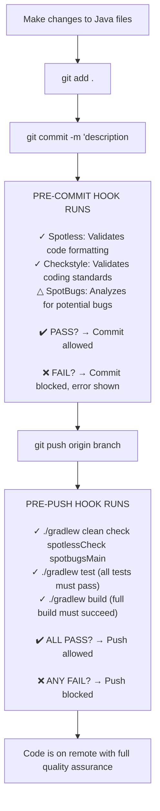

# Git Hooks Quick Visual Guide

## Table of Contents

- [What Just Got Set Up](#what-just-got-set-up)
- [Daily Workflow](#daily-workflow)
- [Pre-Commit Hook Details](#pre-commit-hook-details)
- [Pre-Push Hook Details](#pre-push-hook-details)
- [Remote Quality Assurance](#remote-quality-assurance)

---

## What Just Got Set Up

This guide provides a visual overview of the automated code quality workflow enforced by git hooks in this project.

## Daily Workflow

## Pre-Commit Hook Details

- **Runs on:** `git commit`
- **Checks performed:**
  - Spotless: Validates code formatting
  - Checkstyle: Validates coding standards
  - SpotBugs: Analyzes for potential bugs (does not block commit)
- **Outcome:**
  - ✔️ PASS: Commit allowed
  - ❌ FAIL: Commit blocked, error shown

## Pre-Push Hook Details

- **Runs on:** `git push`
- **Checks performed:**
  - `./gradlew clean check spotlessCheck spotbugsMain`
  - `./gradlew test` (all tests must pass)
  - `./gradlew build` (full build must succeed)
- **Outcome:**
  - ✔️ ALL PASS: Push allowed
  - ❌ ANY FAIL: Push blocked

## Remote Quality Assurance

- Code is only on the remote repository after passing all local quality checks and tests.
- Ensures that only high-quality, tested code reaches the shared repository.
