# Git Hooks Quick Visual Guide

- [Git Hooks Quick Visual Guide](#git-hooks-quick-visual-guide)
  - [✅ What Just Got Set Up](#-what-just-got-set-up)
  - [Daily Workflow](#daily-workflow)
  - [🔎 Pre-Commit Hook Details](#-pre-commit-hook-details)
  - [🔍 Pre-Push Hook Details](#-pre-push-hook-details)
  - [✅ Remote Quality Assurance](#-remote-quality-assurance)

---

## ✅ What Just Got Set Up

This guide provides a visual overview of the automated code quality workflow enforced by git hooks in this project.

## Daily Workflow

```mermaid
flowchart TD
    A["Make changes to Java files"]
    B["git add ."]
    C["git commit -m 'description"]
    D["PRE-COMMIT HOOK RUNS

    ✓ Spotless: Validates code formatting
    ✓ Checkstyle: Validates coding standards
    △ SpotBugs: Analyzes for potential bugs

    ✔️ PASS? → Commit allowed

    ❌ FAIL? → Commit blocked, error shown"]
    E["git push origin branch"]
    F["PRE-PUSH HOOK RUNS

    ✓ ./gradlew clean check spotlessCheck spotbugsMain
    ✓ ./gradlew test (all tests must pass)
    ✓ ./gradlew build (full build must succeed)

    ✔️ ALL PASS? → Push allowed

    ❌ ANY FAIL? → Push blocked"]
    G["Code is on remote with full quality assurance"]

    A --> B --> C --> D --> E --> F --> G
```

## 🔎 Pre-Commit Hook Details

- **Runs on:** `git commit`
- **Checks performed:**
  - Spotless: Validates code formatting
  - Checkstyle: Validates coding standards
  - SpotBugs: Analyzes for potential bugs (does not block commit)
- **Outcome:**
  - ✔️ PASS: Commit allowed
  - ❌ FAIL: Commit blocked, error shown

## 🔍 Pre-Push Hook Details

- **Runs on:** `git push`
- **Checks performed:**
  - `./gradlew clean check spotlessCheck spotbugsMain`
  - `./gradlew test` (all tests must pass)
  - `./gradlew build` (full build must succeed)
- **Outcome:**
  - ✔️ ALL PASS: Push allowed
  - ❌ ANY FAIL: Push blocked

## ✅ Remote Quality Assurance

- Code is only on the remote repository after passing all local quality checks and tests.
- Ensures that only high-quality, tested code reaches the shared repository.
