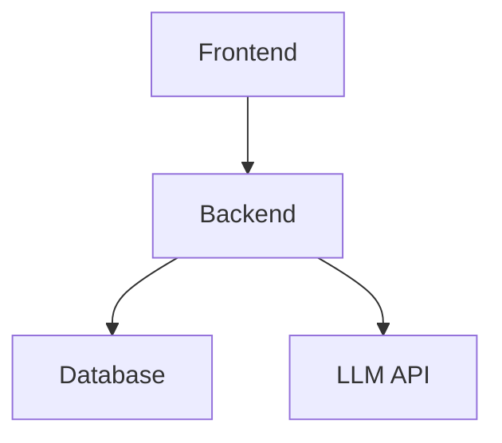

# Screenshot Tools & Resources

Comprehensive guide to tools for capturing, editing, and optimizing screenshots.

## 🎯 Quick Tool Recommendations

### For Different Tasks

| Task           | Recommended Tools | Ease       | Power         | Cost      |
| -------------- | ----------------- | ---------- | ------------- | --------- |
| Quick Capture  | ShareX, Snagit    | ⭐⭐⭐⭐   | ⭐⭐⭐        | Free/$$   |
| Region Select  | Greenshot, ShareX | ⭐⭐⭐⭐   | ⭐⭐⭐        | Free      |
| Scroll Capture | Greenshot, ShareX | ⭐⭐⭐     | ⭐⭐⭐⭐      | Free/$$   |
| Editing        | Paint, Photoshop  | ⭐⭐⭐     | ⭐/⭐⭐⭐⭐⭐ | Free/$$   |
| Compression    | TinyPNG, ILovePDF | ⭐⭐⭐⭐⭐ | ⭐⭐          | Free/$$   |
| Diagrams       | draw.io, Mermaid  | ⭐⭐⭐⭐   | ⭐⭐⭐⭐⭐    | Free/Free |

---

## 📸 Screenshot Capture Tools

### 1. ShareX (RECOMMENDED)

**Best for: Comprehensive screenshot workflow**

**Features:**

- ✅ Region selection capture
- ✅ Window capture
- ✅ Full-page scroll capture
- ✅ Built-in editor
- ✅ Auto-upload options
- ✅ Keyboard shortcuts
- ✅ GIF recording
- ✅ Custom hotkeys

**Installation:**

```bash
# Chocolatey (recommended)
choco install sharex

# Or download from
# https://getsharex.com/
```

**Usage:**

```bash
# Default hotkey: Shift + Print
# Opens menu with capture options

# Common options:
# - Capture region (custom size)
# - Capture full screen
# - Capture window
# - Capture scrolling window
```

**Best Practices:**

1. Set custom hotkey: Ctrl+Shift+S
2. Configure output folder: `docs/screenshots/`
3. Set image format: PNG
4. Enable automatic naming
5. Use quality: 95%

**Cost:** Free (open-source)

---

### 2. Greenshot

**Best for: Free lightweight alternative**

**Features:**

- ✅ Region selection
- ✅ Window capture
- ✅ Full page capture
- ✅ Built-in editor
- ✅ Auto-scroll support
- ✅ Print to file

**Installation:**

```bash
# Chocolatey
choco install greenshot

# Download from
# http://getgreenshot.org/
```

**Usage:**

```bash
# Default hotkey: Print
# Hold Shift for menu

# Common usage:
# Print → Full screen
# Shift + Print → Region select
```

**Best Practices:**

1. Configure hotkeys
2. Set output folder
3. Use PNG format
4. Enable quality settings

**Cost:** Free (open-source)

---

### 3. Snagit

**Best for: Professional screenshot workflow**

**Features:**

- ✅ Advanced region selection
- ✅ Scrolling capture
- ✅ Video recording
- ✅ Professional editor
- ✅ Cloud integration
- ✅ Templates

**Installation:**
Download from: https://www.techsmith.com/screen-capture.html

**Cost:** $49.99 USD

---

### 4. Windows 10/11 Screenshot Tools

**Built-in options (free)**

**Print Screen (Basic)**

```bash
# Full screen capture
Print Screen

# Paste in Paint or document
Ctrl + V
```

**Snipping Tool**

```bash
# Modern version: Win + Shift + S
# Opens snip tool for region capture
# Can capture to clipboard or file
```

**Screenshots App**

```bash
# Windows + Print Screen
# Saves to Pictures\Screenshots
```

**Best for:** Quick captures, no installation needed

---

## 🎨 Image Editing Tools

### 1. Paint (Windows Built-in)

**Best for: Quick edits, annotations**

**Features:**

- ✅ Basic drawing
- ✅ Text overlay
- ✅ Crop and resize
- ✅ Rotate and flip
- ✅ Color adjustments

**Usage:**

```bash
# Open Paint
mspaint

# Open screenshot
Ctrl + O → Select image

# Edit as needed
# Save: Ctrl + S
```

**Best Practices:**

1. Use for simple edits only
2. Add annotations/highlights
3. Crop unnecessary areas
4. Resize for web (max 1200px)

**Cost:** Free (included in Windows)

---

### 2. GIMP (GNU Image Manipulation Program)

**Best for: Professional image editing**

**Features:**

- ✅ Advanced editing
- ✅ Filters and effects
- ✅ Layers
- ✅ Color correction
- ✅ Professional output

**Installation:**

```bash
# Chocolatey
choco install gimp

# Download from
# https://www.gimp.org/
```

**Cost:** Free (open-source)

---

### 3. Photoshop

**Best for: Professional graphic design**

**Features:**

- ✅ Advanced editing
- ✅ Professional filters
- ✅ AI features
- ✅ Cloud integration
- ✅ Batch processing

**Installation:** https://www.adobe.com/

**Cost:** $22.49/month (Creative Cloud subscription)

---

### 4. Online Tools

**Best for: Quick edits without installation**

| Tool          | Features               | URL                                          |
| ------------- | ---------------------- | -------------------------------------------- |
| Canva         | Easy design, templates | https://www.canva.com/                       |
| Pixlr         | Photo editor           | https://pixlr.com/                           |
| PhotoPea      | Photoshop-like         | https://www.photopea.com/                    |
| Photoshop Web | Full Photoshop         | https://www.adobe.com/products/photoshop/web |

---

## 🗜️ Image Compression Tools

### 1. TinyPNG / TinyJPG (RECOMMENDED)

**Best for: Bulk compression**

**Features:**

- ✅ Smart lossy compression
- ✅ Batch upload (20 files)
- ✅ API available
- ✅ Automatic resizing
- ✅ Format conversion

**Usage:**

```bash
# Online tool
https://tinypng.com/

# Upload PNG/JPG files
# Download compressed versions

# Result: 50-80% size reduction
```

**Batch Processing:**

```bash
# PowerShell script for batch compression
# Using TinyPNG API (requires API key)

$apiKey = "YOUR_API_KEY"
$files = Get-ChildItem "docs/screenshots" -Recurse -Filter "*.png"

foreach ($file in $files) {
    # Compress using TinyPNG API
    # Save compressed version
}
```

**Cost:** Free (500/month), Paid for more

---

### 2. ImageMagick (CLI)

**Best for: Batch automation**

**Features:**

- ✅ Command-line interface
- ✅ Batch processing
- ✅ Quality control
- ✅ Format conversion
- ✅ Resize automation

**Installation:**

```bash
# Chocolatey
choco install imagemagick

# Verify
magick --version
```

**Usage:**

```bash
# Compress single image
magick convert input.png -quality 85 output.png

# Resize
magick convert input.png -resize 1200x800 output.png

# Batch compress
FOR /F %f IN ('DIR /B docs\screenshots\*.png') DO (
    magick convert "docs\screenshots\%f" -quality 85 "docs\screenshots\compressed_%f"
)
```

**Cost:** Free (open-source)

---

### 3. PNGQuant

**Best for: PNG optimization**

**Features:**

- ✅ PNG optimization
- ✅ Quality control
- ✅ Batch support
- ✅ Fast processing

**Installation:**

```bash
# Chocolatey
choco install pngquant

# Verify
pngquant --version
```

**Usage:**

```bash
# Optimize PNG
pngquant -o output.png --quality=80-95 input.png

# Batch processing
FOR %%f IN (docs\screenshots\*.png) DO (
    pngquant -o "%%f.opt" --quality=80-95 "%%f"
)
```

**Cost:** Free

---

## 🎨 Diagram & Architecture Tools

### 1. draw.io (RECOMMENDED)

**Best for: Professional diagrams**

**Features:**

- ✅ Web-based
- ✅ Desktop app available
- ✅ Large shape library
- ✅ Cloud storage
- ✅ Collaborative editing
- ✅ Export to PNG/SVG

**Installation:**

```bash
# Online (no installation needed)
https://app.diagrams.net/

# Or desktop app
choco install drawio
```

**Usage:**

1. Create new diagram
2. Drag shapes onto canvas
3. Add text and connections
4. Style as needed
5. Export as PNG (1200x800px)

**Cost:** Free

---

### 2. Mermaid

**Best for: Text-based diagrams**

**Features:**

- ✅ Markdown-based
- ✅ Multiple diagram types
- ✅ Clean output
- ✅ Version control friendly
- ✅ GitHub/GitLab integration

**Diagram Types:**



**Usage:**

1. Write diagram in Mermaid syntax
2. Render in markdown or web
3. Export to PNG using online renderer
4. Save to docs/screenshots/

**Cost:** Free

---

### 3. PlantUML

**Best for: Technical diagrams**

**Features:**

- ✅ UML diagrams
- ✅ Sequence diagrams
- ✅ Component diagrams
- ✅ Text-based
- ✅ Detailed customization

**Installation:**

```bash
# Requires Java
java -version

# Download PlantUML
# https://plantuml.com/download
```

**Cost:** Free (open-source)

---

### 4. Lucidchart

**Best for: Professional diagrams**

**Features:**

- ✅ Professional templates
- ✅ Collaboration
- ✅ Cloud storage
- ✅ Real-time updates
- ✅ Integration support

**Usage:** https://www.lucidchart.com/

**Cost:** Free (limited), Paid from $5/month

---

## 🔧 Browser Tools

### DevTools Screenshots

**Chrome DevTools Screenshot:**

```bash
# Open DevTools: F12
# Cmd Palette: Ctrl + Shift + P
# Type: "screenshot"
# Options:
#   - Capture screenshot
#   - Capture full page screenshot
#   - Capture area screenshot
```

**Firefox Screenshots:**

```bash
# Right-click on page
# Take Screenshot
# Options: Region or Full Page
# Saves to Downloads folder
```

---

## 📋 Batch Processing Scripts

### PowerShell: Batch Screenshot Compression

```powershell
# Batch compress all PNG files in screenshots folder
param(
    [string]$SourceFolder = "docs\screenshots",
    [int]$Quality = 85
)

$png_files = Get-ChildItem -Path $SourceFolder -Recurse -Filter "*.png"

foreach ($file in $png_files) {
    $output = $file.FullName -replace "\.png$", "_compressed.png"

    Write-Host "Compressing: $($file.Name)"

    # Using ImageMagick (if installed)
    magick convert $file.FullName -quality $Quality $output

    # Get file sizes
    $original_size = $file.Length / 1MB
    $new_size = (Get-Item $output).Length / 1MB
    $reduction = [math]::Round(((1 - ($new_size / $original_size)) * 100), 2)

    Write-Host "  Original: $original_size MB"
    Write-Host "  Compressed: $new_size MB"
    Write-Host "  Reduction: $reduction%"
}
```

### Bash: Batch Screenshot Resize

```bash
#!/bin/bash
# Batch resize PNG files to max width 1200px

SOURCE_FOLDER="docs/screenshots"
MAX_WIDTH=1200

find $SOURCE_FOLDER -name "*.png" | while read file; do
    width=$(identify -format "%w" "$file")

    if [ $width -gt $MAX_WIDTH ]; then
        echo "Resizing: $file (width: $width)"
        convert "$file" -resize "${MAX_WIDTH}x" "$file"
    fi
done
```

---

## ✅ Pre-Capture Checklist

Before capturing screenshots:

### Environment Setup

- [ ] Monitor resolution: 1920x1080+
- [ ] Application fully loaded
- [ ] UI stable (no animations)
- [ ] DevTools closed (unless showing)
- [ ] Browser zoomed to 100%

### System Preparation

- [ ] Screen clutter removed
- [ ] Taskbar hidden (if full-screen)
- [ ] Notifications disabled
- [ ] No status messages visible
- [ ] Clean desktop

### Tool Preparation

- [ ] Capture tool installed
- [ ] Hotkey configured
- [ ] Output folder set
- [ ] Format set to PNG
- [ ] Quality configured

### Content Preparation

- [ ] No sensitive data visible
- [ ] No debug console shown
- [ ] Application in normal state
- [ ] No temporary messages
- [ ] Professional appearance

---

## 📚 Additional Resources

### Official Documentation

- [ShareX GitHub](https://github.com/ShareX/ShareX)
- [Greenshot Official](http://getgreenshot.org/)
- [draw.io Documentation](https://www.diagrams.net/doc)
- [Mermaid Documentation](https://mermaid.js.org/)

### Tutorials

- [ShareX Tutorial - YouTube](https://www.youtube.com/results?search_query=sharex+tutorial)
- [draw.io Tutorial](https://www.youtube.com/results?search_query=draw.io+tutorial)
- [Image Compression Guide](https://web.dev/image-optimization/)

### Best Practices

- [Google Screenshot Guidelines](https://developers.google.com/style/screenshots)
- [Microsoft Screenshot Standards](https://docs.microsoft.com/en-us/style-guide/a-z/s/screenshots)
- [Apple Screenshot Guidelines](https://developer.apple.com/design/human-interface-guidelines/)

---

## 🎯 Quick Start

**Fastest Path to Screenshots:**

1. **Install ShareX** (5 min)

   ```bash
   choco install sharex
   ```

2. **Configure hotkey** (1 min)
   - ShareX settings
   - Set to Ctrl+Shift+S

3. **Set output folder** (1 min)
   - Output: `docs\screenshots\`
   - Format: PNG
   - Quality: 95

4. **Start capturing** (2 min)
   - Ctrl+Shift+S
   - Select region
   - Edit if needed
   - Save

5. **Compress images** (5 min)
   - Use TinyPNG online
   - Drag and drop files
   - Download compressed

6. **Verify and organize** (5 min)
   - Move to correct subdirectory
   - Verify naming convention
   - Update markdown links

**Total Time: ~20 minutes**

---

Last Updated: 2026-01-16
