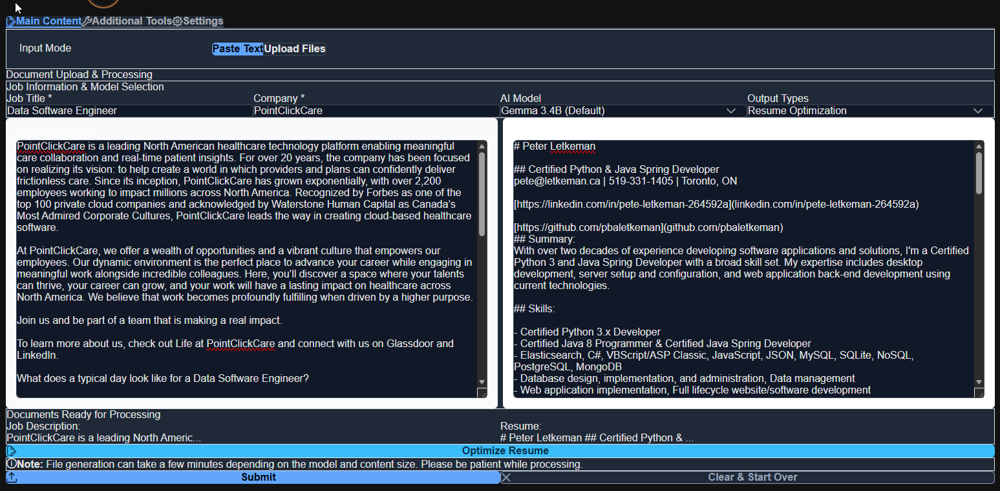

# UI Screenshots - Theme Showcase

Comprehensive visual documentation of the java-resumes application interface with both dark and light theme variants.

## Table of Contents

- [Overview](#overview)
- [Main Tab - Resume Editor](#main-tab---resume-editor)
- [File History Tab](#file-history-tab)
- [Settings Tab](#settings-tab)
- [Tools Tab](#tools-tab)
- [Add Model Dialog](#add-model-dialog)
- [Theme Information](#theme-information)
- [Screenshots Directory](#screenshots-directory)

---

## 📆 Overview

The java-resumes application provides a modern, responsive user interface with full dark/light theme support. All screenshots demonstrate both themes side-by-side for easy comparison.

**Features Shown:**

- ✅ Clean, professional UI design
- ✅ Dark theme (optimized for low-light environments)
- ✅ Light theme (bright, clear interface)
- ✅ PrimeReact component library
- ✅ Tailwind CSS styling
- ✅ Responsive layout

---

## Main Tab - Resume Editor

The primary interface for uploading and editing resume documents with AI-powered optimization.

### Dark Theme


**Features:**

- Clean, organized layout
- Dark background reduces eye strain
- White text for high contrast
- Input fields clearly defined
- Action buttons highlighted

### Light Theme


**Features:**

- Bright, professional appearance
- Easy readability in daylight
- Subtle shadows for depth
- Clear visual hierarchy
- Consistent spacing and alignment

---

## 📤 File History Tab

Browse and manage previously generated and saved documents.

### Dark Theme


**Features:**

- File listing with details
- Date and time stamps
- File size information
- Action buttons for download/delete
- Scrollable list for many files

### Light Theme


**Features:**

- Clear, grid-based layout
- Easy-to-read file information
- Hover effects for interactivity
- Professional appearance
- Consistent with main tab

---

## ⚙️ Settings Tab

Configure application preferences and LLM model settings.

### Dark Theme


**Features:**

- Form controls and inputs
- Toggle switches
- Dropdown selectors
- Clear section headers
- Dark background for comfortable viewing

### Light Theme


**Features:**

- Bright, organized form layout
- Easy-to-read labels and fields
- Professional spacing
- Clear visual separation of sections
- Accessible color contrasts

---

## 🛠️ Tools Tab

Utility functions and development tools.

### Dark Theme


**Features:**

- Tool shortcuts and commands
- Development utilities
- Quick-access buttons
- Dark interface
- Organized layout

### Light Theme


**Features:**

- Clear tool descriptions
- Easy-to-tap buttons
- Professional appearance
- Well-organized sections
- Light background

---

## 📂 Add Model Dialog

Dialog for configuring new LLM model connections (Ollama, OpenAI, etc.).

### Dark Theme


**Features:**

- Form for model configuration
- Input fields for API details
- Dark background
- Clear labels
- Action buttons (Save/Cancel)

### Light Theme


**Features:**

- Bright dialog box
- Easy-to-read form fields
- Professional styling
- Clear visual hierarchy
- Modal overlay

---

## 🎨 Theme Information

### Dark Theme

- **Name:** Dark Mode
- **Purpose:** Comfortable viewing in low-light environments
- **Background:** Dark gray/black
- **Text:** White/light gray
- **Accents:** Bright blue/cyan
- **Ideal For:** Evening work, reduced eye strain

### Light Theme

- **Name:** Light Mode
- **Purpose:** Clear, professional interface for daytime use
- **Background:** White/light gray
- **Text:** Dark gray/black
- **Accents:** Blue/teal
- **Ideal For:** Professional environments, presentations

### Switching Themes

Users can switch between themes:

1. Open **Settings Tab**
2. Look for **Theme Selector**
3. Choose **Dark Mode** or **Light Mode**
4. Changes apply immediately

---

## 📁 Screenshots Directory

```
docs/screenshots/
├── ui/                          # User interface screenshots
│   ├── main-tab-dark.png       # Resume editor - dark theme
│   ├── main-tab-light.png      # Resume editor - light theme
│   ├── file-history-dark.png   # File history - dark theme
│   ├── file-history-light.png  # File history - light theme
│   ├── settings-tab-dark.png   # Settings - dark theme
│   ├── settings-tab-light.png  # Settings - light theme
│   ├── tools-tab-dark.png      # Tools - dark theme
│   ├── tools-tab-light.png     # Tools - light theme
│   ├── add-model-dark.png      # Add model dialog - dark theme
│   └── add-model-light.png     # Add model dialog - light theme
│
├── setup/                       # Setup and deployment screenshots
│   ├── README.md               # Setup screenshots guide
│   ├── local-dev-setup.png     # Docker dev environment
│   ├── build-success.png       # Gradle build completion
│   ├── backend-docker.png      # Backend container logs
│   └── frontend-docker.png     # Frontend container logs
│
├── architecture/               # Architecture diagrams
│   ├── data-flow.png
│   ├── system-architecture-backend.png
│   ├── system-architecture-frontend.png
│   ├── frontend-uml.png
│   ├── backend-uml.png
│   └── document-processing-flow.png
│
└── api/                         # API documentation screenshots
    ├── swagger-ui.png
    ├── api-endpoints.png
    └── error-responses.png
```

---

## 📖 Usage Guidelines

### Including Screenshots in Documentation

When referencing these screenshots in documentation:

1. **Use Relative Paths**

   ```markdown
   
   ```

2. **Provide Context**
   - Explain what the screenshot shows
   - Describe relevant features
   - Link to related documentation

3. **Compare Themes**
   - Show both dark and light variants
   - Use table format for side-by-side comparison
   - Highlight theme-specific features

4. **Markdown Format**
   ```markdown
   |               Dark Theme               |               Light Theme                |
   | :------------------------------------: | :--------------------------------------: |
   |  |  |
   ```

---

## 🎨 Visual Design Standards

### Typography

- **Headers:** Bold, larger font
- **Labels:** Regular weight, medium size
- **Body Text:** Regular weight, standard size
- **Captions:** Lighter weight, smaller size

### Colors

**Dark Theme:**

- Background: `#1a1a1a`
- Text: `#ffffff`
- Accents: `#3b82f6` (blue), `#06b6d4` (cyan)

**Light Theme:**

- Background: `#ffffff`
- Text: `#1f2937` (dark gray)
- Accents: `#2563eb` (blue), `#0891b2` (teal)

### Spacing

- Consistent 16px baseline grid
- 8px, 16px, 24px, 32px spacing increments
- Padding: 16px, 24px, 32px
- Margins: 16px, 24px, 32px

### Components

- **Buttons:** Clear, clickable, with hover states
- **Inputs:** Clear placeholder text, focus states
- **Cards:** Shadow/border separation, padding
- **Dialogs:** Modal overlay, centered content
- **Tabs:** Clear active state indication
- **Lists:** Row separation, hover effects

---

## 📰 Technical Details

### File Formats

- Format: PNG (lossless compression)
- Color Space: RGB
- DPI: 72 (screen resolution)
- Quality: High (suitable for documentation and presentations)

### File Sizes

| Screenshot             | Size    | Dimensions  |
| ---------------------- | ------- | ----------- |
| main-tab-dark.png      | ~109 KB | Full screen |
| main-tab-light.png     | ~112 KB | Full screen |
| file-history-dark.png  | ~29 KB  | Tab view    |
| file-history-light.png | ~29 KB  | Tab view    |
| settings-tab-dark.png  | ~39 KB  | Tab view    |
| settings-tab-light.png | ~39 KB  | Tab view    |
| tools-tab-dark.png     | ~47 KB  | Tab view    |
| tools-tab-light.png    | ~42 KB  | Tab view    |
| add-model-dark.png     | ~7 KB   | Dialog      |
| add-model-light.png    | ~7 KB   | Dialog      |

---

## 🔗 Related Documentation

- [Setup & Deployment Screenshots](./setup/README.md)
- [Architecture Diagrams](./architecture/README.md)
- [API Documentation](./api/README.md)
- [Frontend Development Guide](../../frontend/README.md)
- [Main Project README](../../README.md)

---

**Last Updated:** January 22, 2026
**Status:** ✅ Complete with all theme variants

---

**Last Updated:** February 2, 2026
**Maintained By:** java-resumes development team
