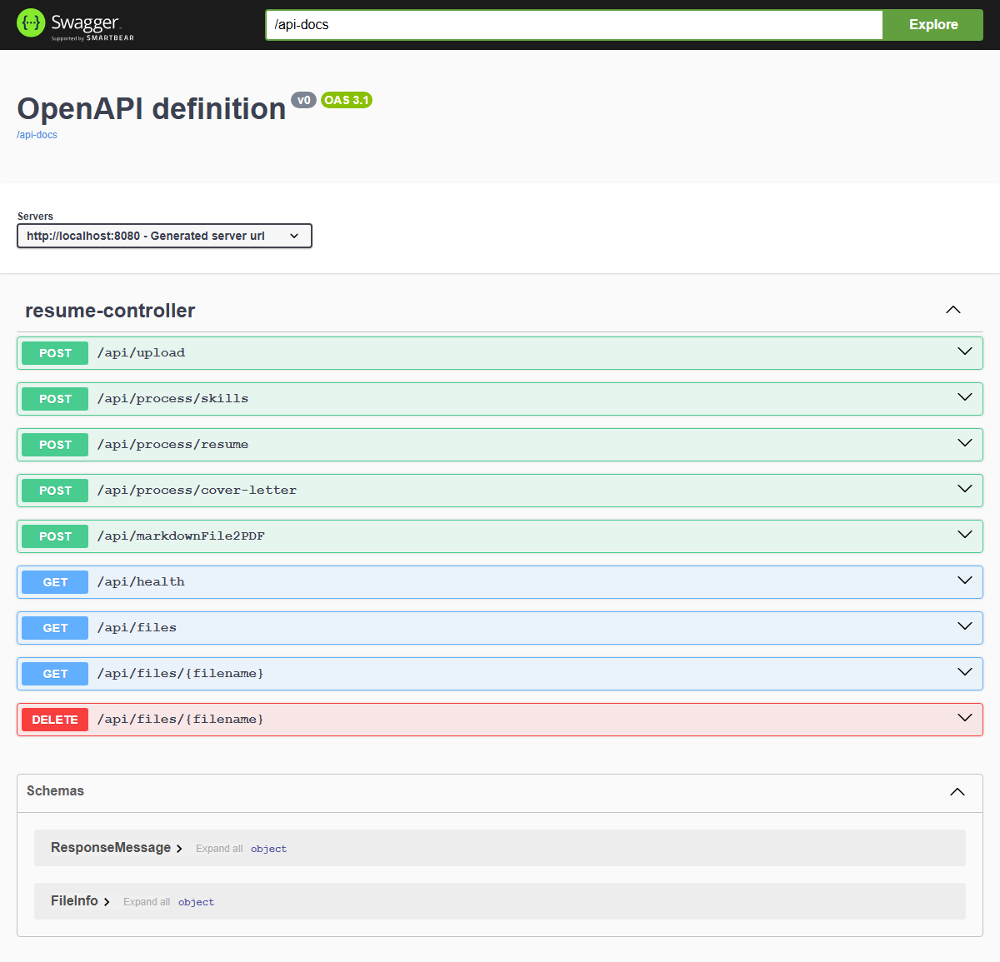
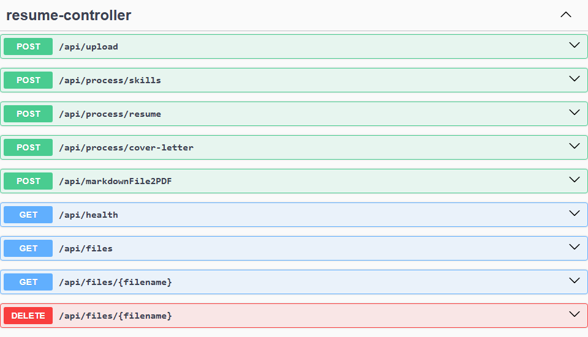
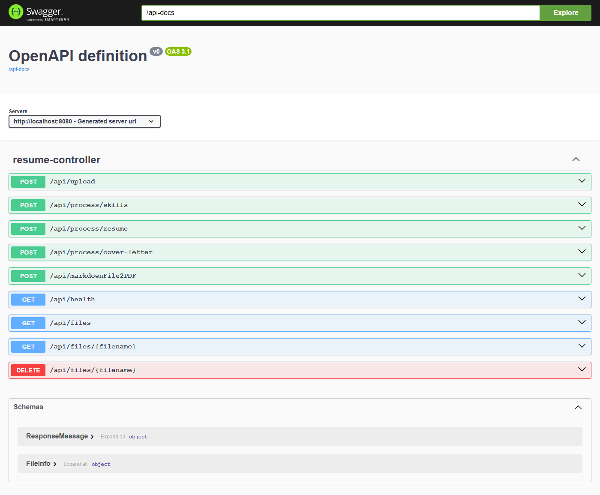

# API Documentation Screenshots

Visual documentation of REST API endpoints, Swagger UI, error responses, and usage examples.

## Table of Contents

- [Overview](#overview)
- [Swagger UI Documentation](#swagger-ui-documentation)
- [API Endpoints Reference](#api-endpoints-reference)
- [Error Responses Guide](#error-responses-guide)
- [Usage Examples](#usage-examples)

---

## 📆 Overview

Complete visual reference for the java-resumes REST API, including endpoint documentation, request/response formats, and error handling.

**API Features:**

- ✅ RESTful design
- ✅ Swagger/OpenAPI documentation
- ✅ JSON request/response format
- ✅ Comprehensive error handling
- ✅ Async processing with 202 Accepted responses
- ✅ File upload/download support

---

## 📚 Swagger UI Documentation

### Swagger Interface



**Features:**

- Interactive API documentation
- Test endpoints directly from browser
- Request/response schemas
- Example values
- Try-it-out functionality

**Access:**

```
http://localhost:8080/swagger-ui/index.html
```

**What You'll See:**

- All available endpoints grouped by controller
- HTTP methods (POST, GET, DELETE)
- Request parameters and body schemas
- Response status codes and content
- Authentication requirements (if any)

---

## 🔗 API Endpoints Reference

### Endpoint Documentation



**Core Endpoints:**

| Method     | Endpoint                | Purpose                      | Response                 |
| ---------- | ----------------------- | ---------------------------- | ------------------------ |
| **POST**   | `/api/upload`           | Optimize resume/cover letter | 202 Accepted (async)     |
| **GET**    | `/api/files`            | List all uploaded files      | 200 OK (file list)       |
| **GET**    | `/api/files/{filename}` | Download specific file       | 200 OK (file download)   |
| **DELETE** | `/api/files/{filename}` | Delete file                  | 200 OK (deletion status) |
| **POST**   | `/api/markdownFile2PDF` | Convert markdown to PDF      | 200 OK (PDF file)        |
| **GET**    | `/api/health`           | Health check endpoint        | 200 OK (status)          |

### Endpoint Details

**POST /api/upload** - Resume Optimization

- **Purpose:** Submit resume and job description for AI optimization
- **Request Body:**
  ```json
  {
    "resume": "Resume content...",
    "jobDescription": "Job posting...",
    "company": "Company Name",
    "jobTitle": "Position Title",
    "temperature": 0.7,
    "model": "mistral",
    "promptType": ["Resume", "CoverLetter"]
  }
  ```
- **Response:** 202 Accepted (processing starts in background)
- **File Output:** Resume and cover letter in markdown + PDF format

**GET /api/files** - List Files

- **Purpose:** Retrieve list of all generated files
- **Response:** Array of file information
  ```json
  {
    "filename": "Resume_Optimized.md",
    "url": "/api/files/Resume_Optimized.md",
    "size": 2048
  }
  ```

**GET /api/files/{filename}** - Download File

- **Purpose:** Download specific generated file
- **Response:** File binary content
- **Support:** PDF, Markdown, HTML files

**DELETE /api/files/{filename}** - Delete File

- **Purpose:** Remove file from system
- **Response:** Success confirmation

**POST /api/markdownFile2PDF** - Markdown Conversion

- **Purpose:** Convert markdown file to PDF
- **Request:** Form data with markdown file
- **Response:** 200 OK (PDF binary)

**GET /api/health** - Health Check

- **Purpose:** Verify API is operational
- **Response:** Status indicator
  ```json
  {
    "status": "UP",
    "message": "API is running"
  }
  ```

---

## ⚠️ Error Responses Guide

### Error Response Examples



**Error Response Format:**

```json
{
  "message": "Descriptive error message",
  "status": "ERROR_CODE",
  "timestamp": "2025-01-22T10:30:00Z"
}
```

### HTTP Status Codes

| Status  | Meaning               | Scenario                            |
| ------- | --------------------- | ----------------------------------- |
| **200** | OK                    | Successful request completed        |
| **202** | Accepted              | Async request accepted (processing) |
| **400** | Bad Request           | Invalid input parameters            |
| **404** | Not Found             | Resource not found                  |
| **500** | Internal Server Error | Server error during processing      |

### Common Error Responses

**400 Bad Request - Missing File**

```json
{
  "message": "No file/invalid file provided.",
  "status": "BAD_REQUEST"
}
```

**400 Bad Request - Invalid Input**

```json
{
  "message": "Required property missing or invalid.",
  "status": "BAD_REQUEST"
}
```

**404 Not Found - File Missing**

```json
{
  "message": "File not found: filename.pdf",
  "status": "NOT_FOUND"
}
```

**500 Internal Server Error - Processing Failed**

```json
{
  "message": "Failed to process resume: error details",
  "status": "INTERNAL_SERVER_ERROR"
}
```

### Error Handling Best Practices

1. **Check Status Code First**
   - 202 = Still processing (wait and retry)
   - 200 = Success
   - 400 = Invalid input (check parameters)
   - 500 = Server error (contact support)

2. **Read Error Message**
   - Messages are descriptive
   - Indicate missing fields or invalid values
   - Suggest corrective actions

3. **Implement Retry Logic**
   - For 202 responses: Poll every 2-3 seconds
   - For 500 errors: Implement exponential backoff
   - For temporary failures: Retry up to 3 times

4. **Log Errors**
   - Store error responses for debugging
   - Track error patterns for improvements
   - Monitor error rates for reliability

---

## 📚 Usage Examples

### Complete Request/Response Flow

**1. Upload Resume for Optimization**

```bash
curl -X POST http://localhost:8080/api/upload \
  -H "Content-Type: application/json" \
  -d '{
    "resume": "John Doe...",
    "jobDescription": "Seeking experienced...",
    "company": "TechCorp",
    "jobTitle": "Senior Developer",
    "temperature": 0.7,
    "model": "mistral",
    "promptType": ["Resume", "CoverLetter"]
  }'
```

**Response (202 Accepted):**

```json
{
  "message": "generating"
}
```

**2. Poll for Results**

```bash
curl -X GET http://localhost:8080/api/files
```

**Response (200 OK):**

```json
[
  {
    "filename": "Resume_Optimized.md",
    "url": "/api/files/Resume_Optimized.md",
    "size": 2048
  },
  {
    "filename": "Resume_Optimized.pdf",
    "url": "/api/files/Resume_Optimized.pdf",
    "size": 45000
  },
  {
    "filename": "CoverLetter_Optimized.md",
    "url": "/api/files/CoverLetter_Optimized.md",
    "size": 1500
  }
]
```

**3. Download File**

```bash
curl -X GET http://localhost:8080/api/files/Resume_Optimized.pdf \
  --output Resume_Optimized.pdf
```

### JavaScript/Axios Example

```typescript
// Submit optimization request
const response = await axios.post("http://localhost:8080/api/upload", {
  resume: resumeContent,
  jobDescription: jobContent,
  company: "Company Name",
  jobTitle: "Position Title",
  temperature: 0.7,
  model: "mistral",
  promptType: ["Resume", "CoverLetter"],
});

// Poll for results
const pollResults = async () => {
  const files = await axios.get("http://localhost:8080/api/files");
  if (files.data.length > 0) {
    // Files ready!
    return files.data;
  } else {
    // Wait and try again
    setTimeout(pollResults, 2000);
  }
};

// Download file
const file = await axios.get(
  "http://localhost:8080/api/files/Resume_Optimized.pdf",
  { responseType: "blob" },
);
```

### cURL Download Example

```bash
# Download PDF file
curl -X GET http://localhost:8080/api/files/Resume_Optimized.pdf \
  --output Resume_Optimized.pdf

# Download Markdown file
curl -X GET http://localhost:8080/api/files/Resume_Optimized.md \
  --output Resume_Optimized.md

# List all files
curl -X GET http://localhost:8080/api/files | jq '.'

# Delete file
curl -X DELETE http://localhost:8080/api/files/Resume_Optimized.md
```

---

## Configuration Reference

### API Configuration

**Backend Application Properties:**

```properties
server.port=8080
server.servlet.context-path=/
server.error.include-message=always
spring.servlet.multipart.max-file-size=10MB
```

### CORS Configuration

The API is configured with CORS support:

```java
@CrossOrigin(origins = "*")
```

This allows requests from:

- Frontend on localhost:3000 (development)
- Frontend on any origin (production deployment)
- Web-based API clients

### Request Validation

All requests are validated for:

- Required fields present
- File size within limits (10MB)
- Content type compatibility
- LLM configuration validity

---

## Performance Characteristics

### Response Times

| Operation      | Typical Time | Notes                   |
| -------------- | ------------ | ----------------------- |
| File upload    | < 500ms      | Return 202 accepted     |
| LLM processing | 30-120s      | Depends on model, async |
| File list      | < 200ms      | In-memory operation     |
| File download  | < 500ms      | Direct file read        |

### Concurrency

- Multiple requests processed simultaneously
- Async processing prevents blocking
- Background threads pool for scalability
- No limit on concurrent file uploads

### Resource Limits

- Max file size: 10 MB
- Max concurrent uploads: Unlimited
- Storage: Filesystem based (configurable)
- Memory: Depends on JVM configuration

---

## Documentation Files

### Directory Structure

```
docs/screenshots/api/
├── README.md                      # This file
├── swagger-ui.png                # Swagger documentation UI
├── api-endpoints.png             # Endpoint reference
└── error-responses.png           # Error response examples
```

### Related Documentation

- **[Backend README](../../BACKEND_README.md)** - Complete backend API documentation
- **[Main Architecture](../../Architecture.md)** - System architecture and design
- **[Docker Setup](../../DOCKER_DEV_SETUP.md)** - Deployment and configuration
- **[Quick Reference](../../QUICK_REFERENCE.md)** - Quick command reference

---

**Last Updated:** January 22, 2026
**Status:** ✅ Complete API documentation with screenshots

---

**Last Updated:** February 2, 2026
**Maintained By:** java-resumes development team
