# Architecture Diagrams

This directory contains architecture diagrams and visual representations of the java-resumes system.

## � Table of Contents

1. [System Architecture](#system-architecture)
2. [Component Architecture](#component-architecture)
3. [Data Flow Diagram](#data-flow-diagram)
4. [Deployment Architecture](#deployment-architecture)
5. [Docker Compose Structure](#docker-compose-structure)
6. [Request/Response Flow](#request-response-flow)
7. [Backend Component Dependencies (UML)](#backend-component-dependencies-uml)
8. [Frontend Component Dependencies (UML)](#frontend-component-dependencies-uml)
9. [Authentication & Security](#authentication--security)
10. [Scalability Patterns](#scalability-patterns)

---

## �📊 Diagrams Included

### System Architecture


### Component Architecture

**Frontend Components**:


**Backend Components**:


### Data Flow Diagram


### Deployment Architecture

```mermaid
graph TB
    Host["Host Machine"]

    subgraph DockerNetwork["Docker Network: java-resumes"]
        subgraph Backend["Backend Container"]
            BuildStage["Build Stage<br/>gradle:8.7-jdk17"]
            BackendRuntime["Runtime<br/>eclipse-temurin:17-jre-alpine<br/>Port: 8080<br/>Java App: app.jar"]
            BackendEnv["Environment<br/>JAVA_OPTS<br/>Spring Profile"]
            BackendVolume["Volumes<br/>/app/uploads/"]
        end

        subgraph Frontend["Frontend Container"]
            FrontendBuild["Build<br/>node:18-alpine<br/>npm run build"]
            FrontendServer["Server<br/>nginx<br/>Port: 80"]
            FrontendPorts["Port Mapping<br/>80→5173 dev<br/>80→3173 prod"]
            FrontendEnv["Environment<br/>REACT_APP_API_URL"]
        end
    end

    BuildStage --> BackendRuntime
    BackendRuntime --> BackendEnv
    BackendRuntime --> BackendVolume

    FrontendBuild --> FrontendServer
    FrontendServer --> FrontendPorts
    FrontendServer --> FrontendEnv

    BackendRuntime <-->|REST API| FrontendServer

    Host --> DockerNetwork
    Host --> BackendVolume

    Host -.->|Port 8080| BackendRuntime
    Host -.->|Port 80| FrontendServer
```



### Docker Compose Structure

```yaml
services:
  backend:
    build:
      context: .
      dockerfile: Dockerfile
    ports:
      - "8080:8080"
    volumes:
      - ./uploads:/app/uploads
    environment:
      - SPRING_PROFILE_ACTIVE=docker
    depends_on:
      - (LLM service - external)

  frontend:
    build:
      context: ./frontend
      dockerfile: Dockerfile
    ports:
      - "80:80"
    depends_on:
      - backend
    environment:
      - REACT_APP_API_URL=http://backend:8080

volumes:
  uploads:
    driver: local

networks:
  default:
    name: java-resumes
```

---

## 📈 Request/Response Flow


---

## Backend Component Dependencies (UML)


---

## Frontend Component Dependencies (UML)


---

## 🔄 Authentication & Security

Current Implementation:

- No authentication required (local use)
- File storage on local filesystem
- Direct API access

Production Considerations:

- Add JWT authentication
- Implement rate limiting
- Add HTTPS/TLS
- File size limits
- Input validation
- CORS configuration
- API key management

---

## 🚀 Scalability Patterns

### Horizontal Scaling


### Message Queue Pattern


---

## 📚 References

- [Full Architecture Documentation](../Architecture.md)
- [Backend Implementation](../BACKEND_README.md)
- [Frontend Setup](../../frontend/README.md)
- [Docker Configuration](../../Dockerfile)
- [Docker Compose Setup](../../docker-compose.yml)

---
  
---  
  
**Last Updated:** February 2, 2026  
**Maintained By:** java-resumes development team 
