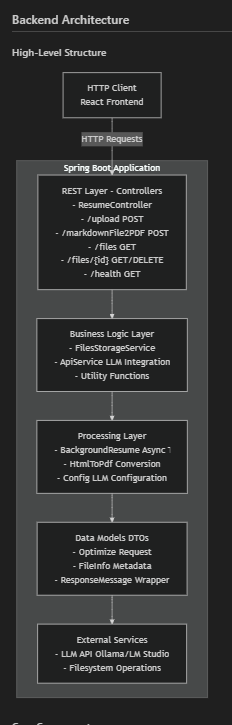
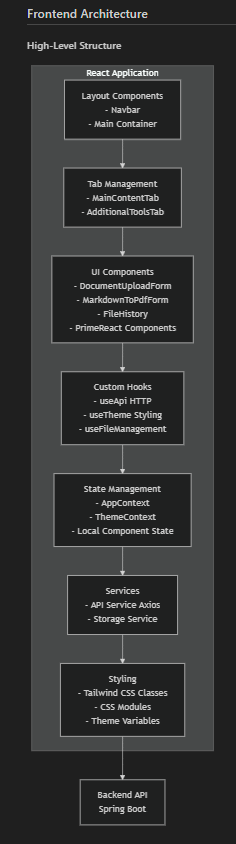
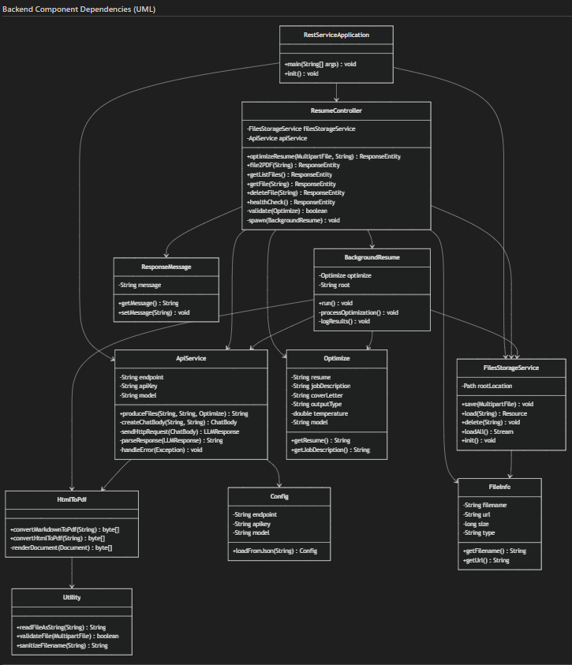
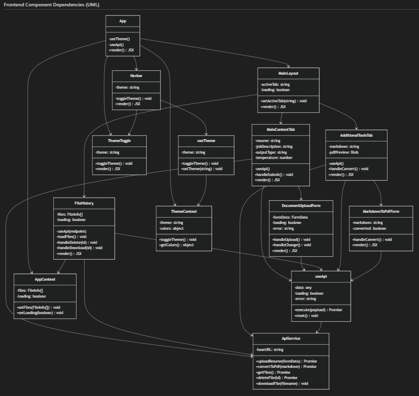

# Architecture Diagrams & Visual Documentation

System architecture, component diagrams, and data flow visualizations for the java-resumes application.

## Table of Contents

- [Overview](#overview)
- [System Architecture](#system-architecture)
- [Data Flow Diagram](#data-flow-diagram)
- [UML Diagrams](#uml-diagrams)
- [Component Relationships](#component-relationships)
- [Deployment Architecture](#deployment-architecture)

---

## 📆 Overview

Comprehensive visual documentation of system architecture, showing how components interact and data flows through the application.

**Architecture Covers:**

- ✅ Frontend React application
- ✅ Spring Boot backend services
- ✅ LLM API integration (Ollama/OpenAI)
- ✅ File storage and processing
- ✅ Docker containerization
- ✅ Component interactions

---

## 🎨 System Architecture

### Overall Architecture Diagram



**Shows:**

- Spring Boot application with REST API
- Controller layer (API endpoints)
- Service layer (business logic)
- Data models and repositories
- External API connections
- File storage integration



**Shows:**

- React component structure
- State management (Context API)
- Custom hooks organization
- API communication layer
- Theme and styling system
- Component hierarchy

---

## 🔄 Data Flow Diagram

The complete flow of resume optimization from upload to download:


**Flow Steps:**

1. **Upload Phase**
   - User uploads resume and job description
   - Frontend sends to backend via REST API
   - Backend validates files

2. **Processing Phase**
   - Backend spawns background thread
   - LLM API called with document content
   - Content optimized and enhanced

3. **Output Phase**
   - Generated files (markdown, PDF) created
   - Files saved to filesystem
   - Frontend polls for results

4. **Download Phase**
   - Frontend detects new files
   - User downloads optimized documents
   - Files available in File History

---

## 📋 UML Diagrams

### Backend Class Diagram



**Key Classes:**

- `ResumeController` - REST API endpoints
- `BackgroundResume` - Async processing thread
- `ApiService` - LLM integration
- `FilesStorageService` - File operations
- `Optimize` - Request model
- `FileInfo` - Response model

**Relationships:**

- Controllers use Services
- Services use Model classes
- Background threads manage processing
- External API integration points

### Frontend Component Diagram



**Key Components:**

- `App` - Main application wrapper
- `MainContentTab` - Primary UI interface
- `FileHistoryTab` - File management
- `SettingsTab` - Configuration
- `ToolsTab` - Utilities
- Custom Hooks - `useApi`, `useTheme`

**Relationships:**

- Components use custom hooks
- Context providers manage state
- API hooks handle communication
- Theme context provides styling

---

## 🔗 Component Relationships

### Backend Component Interaction

```
┌─────────────────┐
│  ResumeController │ ← REST API Endpoints
└────────┬────────┘
         │
         ├─→ ┌──────────────────┐
         │   │ FilesStorageService │ ← File Upload/Download
         │   └──────────────────┘
         │
         ├─→ ┌────────────────┐
         │   │ BackgroundResume │ ← Async Processing
         │   └────────┬───────┘
         │            │
         │            ├─→ ┌─────────────┐
         │                │ ApiService  │ ← LLM Integration
         │                └─────────────┘
         │
         └─→ ┌──────────────────┐
             │ Model Classes    │ ← DTOs & Entities
             └──────────────────┘
```

### Frontend Component Hierarchy

```
┌──────────┐
│   App    │ (Main component)
└────┬─────┘
     │
     ├─→ ┌──────────────┐
     │   │ MainContentTab│ (Resume editor)
     │   └──────────────┘
     │
     ├─→ ┌──────────────┐
     │   │ FileHistoryTab│ (File management)
     │   └──────────────┘
     │
     ├─→ ┌──────────────┐
     │   │ SettingsTab   │ (Configuration)
     │   └──────────────┘
     │
     ├─→ ┌──────────────┐
     │   │ ToolsTab      │ (Utilities)
     │   └──────────────┘
     │
     └─→ ┌──────────────────┐
         │ Custom Hooks     │ (useApi, useTheme)
         └──────────────────┘
```

---

## 🚀 Deployment Architecture

### Docker Container Architecture

**Backend Container:**

- Base: `eclipse-temurin:21-jdk`
- Framework: Spring Boot 3.5.1
- Build Tool: Gradle 8.10
- Port: 8080
- Features: REST API, async processing

**Frontend Container (Development):**

- Base: `node:22-alpine`
- Framework: React 19 + Vite
- Port: 3000
- Features: Hot module reload, dev server

**Frontend Container (Production):**

- Base: `nginx:alpine`
- Build: Static React build
- Port: 80
- Features: Static file serving

### Docker Compose Orchestration

```
┌─────────────────────────────────────────┐
│        Docker Compose Network            │
├─────────────────────────────────────────┤
│                                         │
│  ┌──────────────────┐                  │
│  │ Backend Service  │                  │
│  │ Spring Boot 3.5  │                  │
│  │ Port: 8080       │                  │
│  └──────────────────┘                  │
│           ▲                            │
│           │ HTTP                       │
│           │                            │
│  ┌──────────────────┐                  │
│  │ Frontend Service │                  │
│  │ React + Vite     │                  │
│  │ Port: 3000       │                  │
│  └──────────────────┘                  │
│           │                            │
│           └────→ External APIs         │
│                 (Ollama, OpenAI)       │
│                                         │
└─────────────────────────────────────────┘
```

---

## 🌐 API Integration

### LLM Service Integration

**Supported Services:**

- Ollama (local LLM, free)
- OpenAI (commercial API)
- Any OpenAI-compatible endpoint

**Request Flow:**

1. Frontend → Backend: Resume + Job Description
2. Backend → LLM Service: OpenAI-compatible request
3. LLM Service → Backend: Optimized content
4. Backend → Frontend: Generated files (markdown, PDF)

**Configuration:**

```json
{
  "endpoint": "http://localhost:11434/v1/chat/completions",
  "apikey": "ollama",
  "model": "mistral"
}
```

---

## 🚰 Technology Stack Visualization

### Backend Stack

```
Spring Boot 3.5.1
├── Spring Web (REST API)
├── Spring Data (Data access)
├── Gradle 8.10 (Build)
├── JUnit 5 (Testing)
├── Gson (JSON)
├── jsoup (HTML parsing)
└── Flying Saucer (PDF generation)
```

### Frontend Stack

```
React 19 + TypeScript 5.9
├── Vite 7.3.1 (Build tool)
├── PrimeReact 10.9.7 (Components)
├── Tailwind CSS 4.1.18 (Styling)
├── Vitest (Testing)
├── Axios (HTTP client)
└── React Icons (Icons)
```

### Infrastructure Stack

```
Docker & Docker Compose
├── Backend: eclipse-temurin:21-jdk
├── Frontend Dev: node:22-alpine
├── Frontend Prod: nginx:alpine
└── Network: Internal DNS resolution
```

---

## 📋 Data Models

### Core Data Models

**Optimize Request Model:**

- Resume content
- Job description
- Target company/position
- LLM temperature setting
- Output types (Resume, Cover Letter)

**FileInfo Response Model:**

- Filename
- Download URL
- File size
- Creation timestamp

**BackgroundResume Thread:**

- Manages async processing
- Coordinates API calls
- Handles file writing
- Error handling

---

## 🔗 Related Documentation

- **[Backend README](../BACKEND_README.md)** - Backend API and service documentation
- **[Frontend README](../../frontend/README.md)** - Frontend component and hook documentation
- **[Docker Setup Guide](../DOCKER_DEV_SETUP.md)** - Docker configuration and deployment
- **[Main Architecture Document](../Architecture.md)** - Comprehensive technical documentation

---

**Last Updated:** January 22, 2026
**Status:** ✅ Complete with all architecture diagrams

---

**Last Updated:** February 2, 2026
**Maintained By:** java-resumes development team
