# Architecture Diagrams & Visual Documentation

System architecture, component diagrams, and data flow visualizations for the java-resumes application.

- [Architecture Diagrams \& Visual Documentation](#architecture-diagrams--visual-documentation)
  - [📆 Overview](#-overview)
  - [🎨 System Architecture](#-system-architecture)
    - [Overall Architecture Diagram](#overall-architecture-diagram)
  - [🔄 Data Flow Diagram](#-data-flow-diagram)
  - [📋 UML Diagrams](#-uml-diagrams)
    - [Backend Class Diagram](#backend-class-diagram)
    - [Frontend Component Diagram](#frontend-component-diagram)
  - [🔗 Component Relationships](#-component-relationships)
    - [Backend Component Interaction](#backend-component-interaction)
    - [Frontend Component Hierarchy](#frontend-component-hierarchy)
  - [🚀 Deployment Architecture](#-deployment-architecture)
    - [Docker Container Architecture](#docker-container-architecture)
    - [Docker Compose Orchestration](#docker-compose-orchestration)
  - [🌐 API Integration](#-api-integration)
    - [LLM Service Integration](#llm-service-integration)
  - [🚰 Technology Stack Visualization](#-technology-stack-visualization)
    - [Backend Stack](#backend-stack)
    - [Frontend Stack](#frontend-stack)
    - [Infrastructure Stack](#infrastructure-stack)
  - [📋 Data Models](#-data-models)
    - [Core Data Models](#core-data-models)
  - [🔗 Related Documentation](#-related-documentation)

---

## 📆 Overview

Comprehensive visual documentation of system architecture, showing how components interact and data flows through the application.

**Architecture Covers:**

- ✅ Frontend React application
- ✅ Spring Boot backend services
- ✅ LLM API integration (Ollama/OpenAI)
- ✅ File storage and processing
- ✅ Docker containerization
- ✅ Component interactions

---

## 🎨 System Architecture

### Overall Architecture Diagram


**Shows:**

- Spring Boot application with REST API
- Controller layer (API endpoints)
- Service layer (business logic)
- Data models and repositories
- External API connections
- File storage integration


**Shows:**

- React component structure
- State management (Context API)
- Custom hooks organization
- API communication layer
- Theme and styling system
- Component hierarchy

---

## 🔄 Data Flow Diagram

The complete flow of resume optimization from upload to download:


**Flow Steps:**

1. **Upload Phase**
   - User uploads resume and job description
   - Frontend sends to backend via REST API
   - Backend validates files

2. **Processing Phase**
   - Backend spawns background thread
   - LLM API called with document content
   - Content optimized and enhanced

3. **Output Phase**
   - Generated files (markdown, PDF) created
   - Files saved to filesystem
   - Frontend polls for results

4. **Download Phase**
   - Frontend detects new files
   - User downloads optimized documents
   - Files available in File History

---

## 📋 UML Diagrams

### Backend Class Diagram


**Key Classes:**

- `ResumeController` - REST API endpoints
- `BackgroundResume` - Async processing thread
- `ApiService` - LLM integration
- `FilesStorageService` - File operations
- `Optimize` - Request model
- `FileInfo` - Response model

**Relationships:**

- Controllers use Services
- Services use Model classes
- Background threads manage processing
- External API integration points

### Frontend Component Diagram


**Key Components:**

- `App` - Main application wrapper
- `MainContentTab` - Primary UI interface
- `FileHistoryTab` - File management
- `SettingsTab` - Configuration
- `ToolsTab` - Utilities
- Custom Hooks - `useApi`, `useTheme`

**Relationships:**

- Components use custom hooks
- Context providers manage state
- API hooks handle communication
- Theme context provides styling

---

## 🔗 Component Relationships

### Backend Component Interaction


### Frontend Component Hierarchy


---

## 🚀 Deployment Architecture

### Docker Container Architecture

**Backend Container:**

- Base: `eclipse-temurin:21-jdk`
- Framework: Spring Boot 3.5.1
- Build Tool: Gradle 8.10
- Port: 8080
- Features: REST API, async processing

**Frontend Container (Development):**

- Base: `node:22-alpine`
- Framework: React 19 + Vite
- Port: 3000
- Features: Hot module reload, dev server

**Frontend Container (Production):**

- Base: `nginx:alpine`
- Build: Static React build
- Port: 80
- Features: Static file serving

### Docker Compose Orchestration

```mermaid
graph TB
    subgraph compose["Docker Compose Network"]
        A["🐳 Backend Service<br/>Spring Boot 3.5<br/>Port: 8080"]
        B["🐳 Frontend Service<br/>React + Vite<br/>Port: 3000"]
        C["🔗 External APIs<br/>Ollama/OpenAI"]
    end

    B -->|HTTP Requests| A
    A -->|REST Calls| C

    style compose fill:#eceff1
    style A fill:#bbdefb
    style B fill:#c8e6c9
    style C fill:#ffccbc
```



---

## 🌐 API Integration

### LLM Service Integration

**Supported Services:**

- Ollama (local LLM, free)
- OpenAI (commercial API)
- Any OpenAI-compatible endpoint

**Request Flow:**

1. Frontend → Backend: Resume + Job Description
2. Backend → LLM Service: OpenAI-compatible request
3. LLM Service → Backend: Optimized content
4. Backend → Frontend: Generated files (markdown, PDF)

**Configuration:**

```json
{
  "endpoint": "http://localhost:11434/v1/chat/completions",
  "apikey": "ollama",
  "model": "mistral"
}
```

---

## 🚰 Technology Stack Visualization

### Backend Stack


### Frontend Stack


### Infrastructure Stack


---

## 📋 Data Models

### Core Data Models

**Optimize Request Model:**

- Resume content
- Job description
- Target company/position
- LLM temperature setting
- Output types (Resume, Cover Letter)

**FileInfo Response Model:**

- Filename
- Download URL
- File size
- Creation timestamp

**BackgroundResume Thread:**

- Manages async processing
- Coordinates API calls
- Handles file writing
- Error handling

---

## 🔗 Related Documentation

- **[Backend README](../BACKEND_README.md)** - Backend API and service documentation
- **[Frontend README](../../frontend/README.md)** - Frontend component and hook documentation
- **[Docker Setup Guide](../DOCKER_DEV_SETUP.md)** - Docker configuration and deployment
- **[Main Architecture Document](../Architecture.md)** - Comprehensive technical documentation

---

**Last Updated:** January 22, 2026
**Status:** ✅ Complete with all architecture diagrams

---

**Last Updated:** February 2, 2026
**Maintained By:** java-resumes development team
